# Data Model Documentation

## Overview

This document describes all data models, entities, fields, and relationships in ThaiHeavensSignApp.

## Entity Relationship Diagram

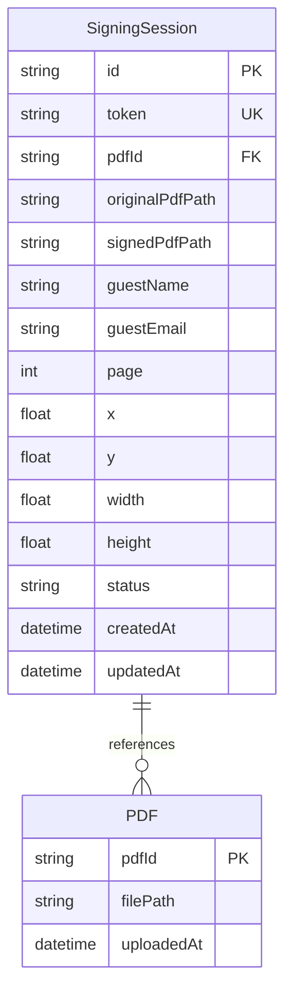

### Relationship Explanation

- **SigningSession** references **PDF** via `pdfId`
- One PDF can have multiple sessions (one-to-many)
- Each session has one original PDF and optionally one signed PDF

---

## SigningSession Entity

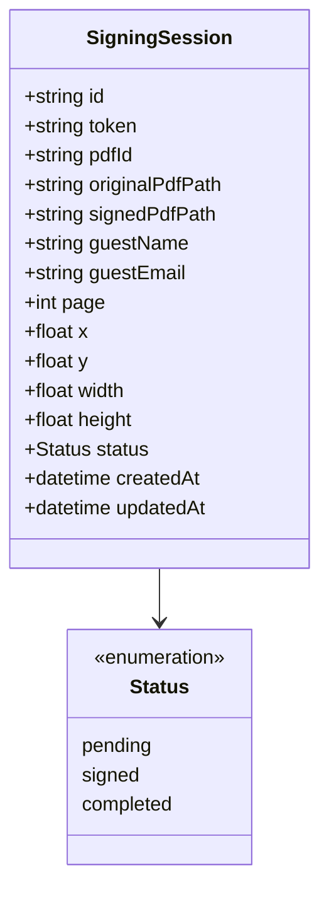

### Field Descriptions

| Field | Type | Required | Description |
|-------|------|----------|-------------|
| `id` | string (UUID) | Yes | Unique session identifier |
| `token` | string | Yes | Public token for signing link (UUID without dashes) |
| `pdfId` | string (UUID) | Yes | Reference to original PDF |
| `originalPdfPath` | string | Yes | Absolute path to original PDF file |
| `signedPdfPath` | string | Optional | Absolute path to signed PDF file |
| `guestName` | string | Optional | Guest's name |
| `guestEmail` | string | Optional | Guest's email address |
| `page` | number | Yes | PDF page index (0-based) where signature appears |
| `x` | number | Yes | X coordinate in PDF points (bottom-left origin) |
| `y` | number | Yes | Y coordinate in PDF points (bottom-left origin) |
| `width` | number | Yes | Signature width in PDF points |
| `height` | number | Yes | Signature height in PDF points |
| `status` | enum | Yes | Session status: 'pending', 'signed', 'completed' |
| `createdAt` | string (ISO) | Yes | Creation timestamp |
| `updatedAt` | string (ISO) | Yes | Last update timestamp |

### Status State Machine

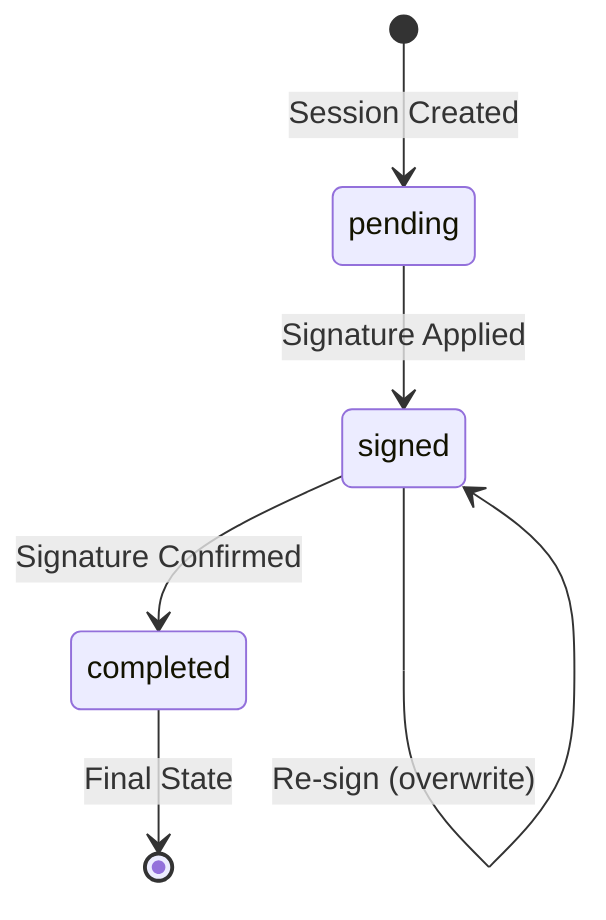

### Status Transitions

1. **pending:** Initial state when session is created
2. **signed:** Signature has been applied to PDF
3. **completed:** Signature has been confirmed and session is finalized

---

## PDF Entity (Implicit)

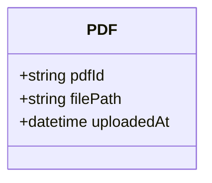

### Field Descriptions

| Field | Type | Description |
|-------|------|-------------|
| `pdfId` | string (UUID) | Unique PDF identifier |
| `filePath` | string | Absolute path to PDF file |
| `uploadedAt` | datetime | Upload timestamp (implicit from file system) |

**Note:** PDF entity is implicit - stored as files in `storage/original/` directory, not in database.

---

## Frontend Data Models

### SessionPublicInfo

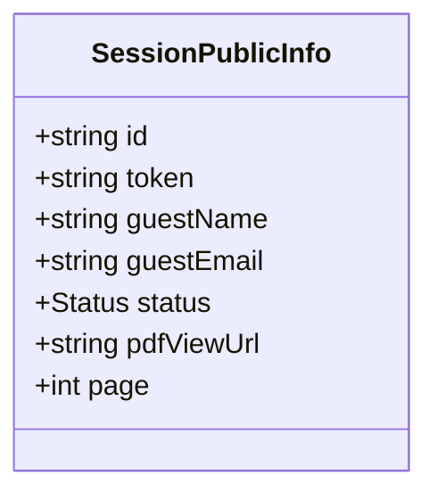

**Purpose:** Public-facing session data (no internal file paths)

**Fields:**
- `id`: Session ID
- `token`: Public token
- `guestName`: Optional guest name
- `guestEmail`: Optional guest email
- `status`: Session status
- `pdfViewUrl`: Public URL to view PDF (`/api/pdf/:pdfId`)
- `page`: PDF page number

### CreateSessionRequest

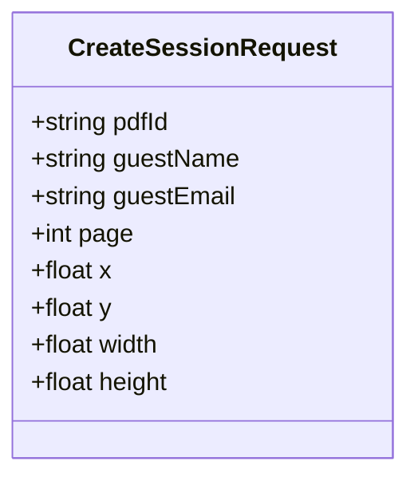

**Purpose:** Request payload for creating a session

**Fields:**
- All coordinate fields in PDF points (bottom-left origin)
- `page`: 0-based page index

### CreateSessionResponse

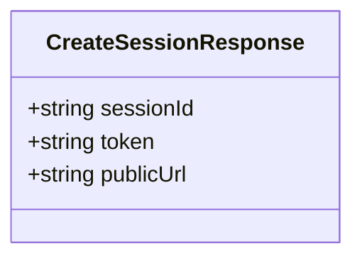

**Purpose:** Response after creating a session

**Fields:**
- `sessionId`: Internal session ID
- `token`: Public token for signing link
- `publicUrl`: Relative URL path (`/sign/:token`)

---

## Coordinate System Models

### Canvas Coordinates

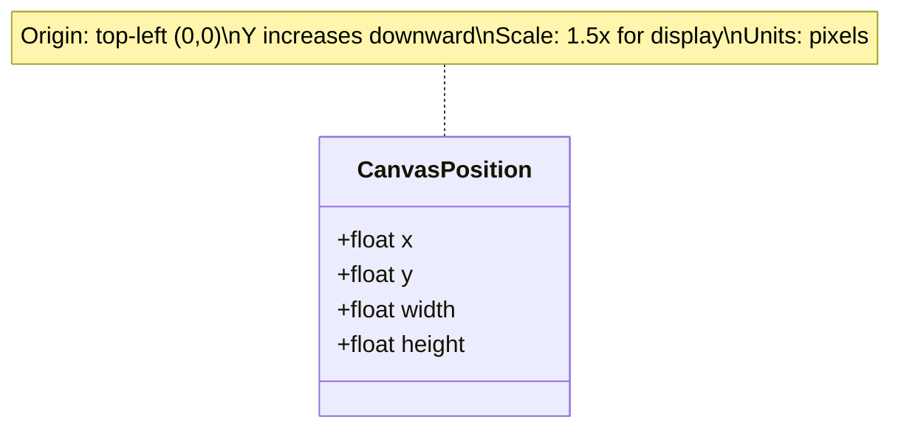

### PDF Coordinates

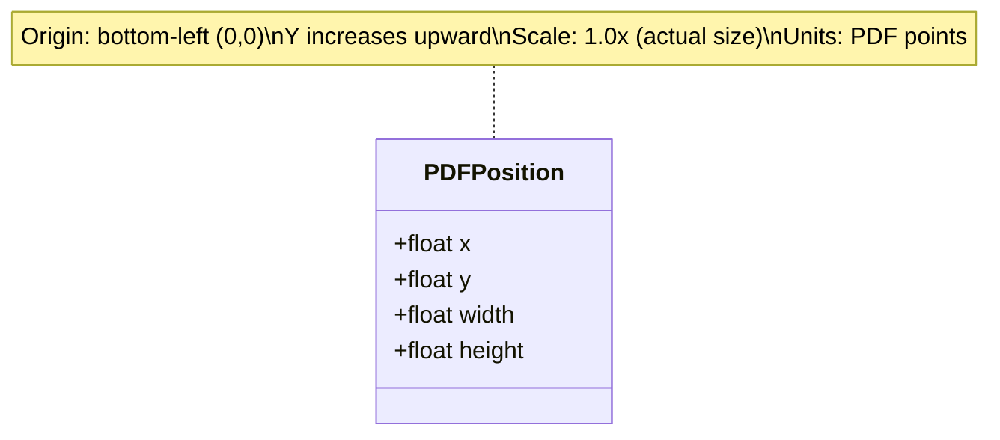

### Coordinate Conversion

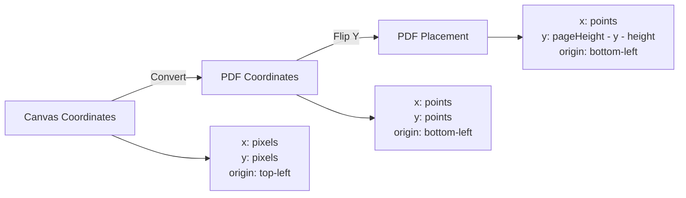

---

## Storage Structure

### File System Model

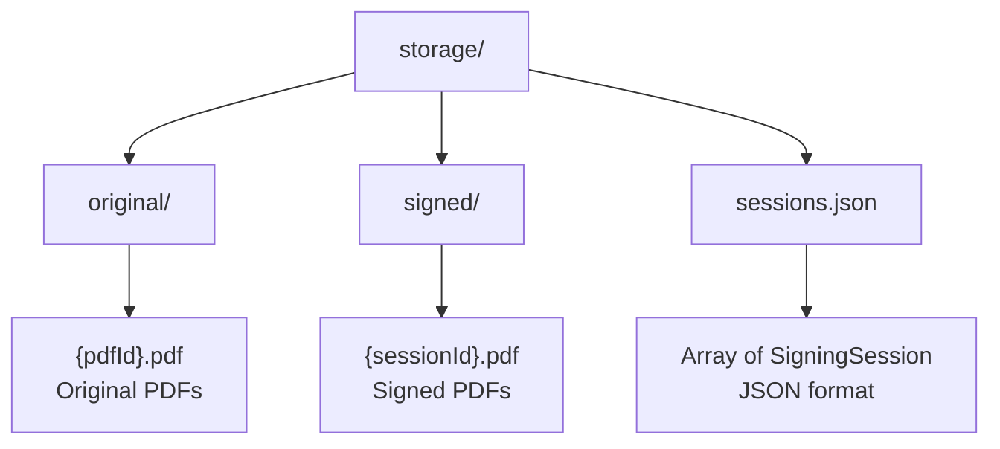

### Sessions JSON Structure

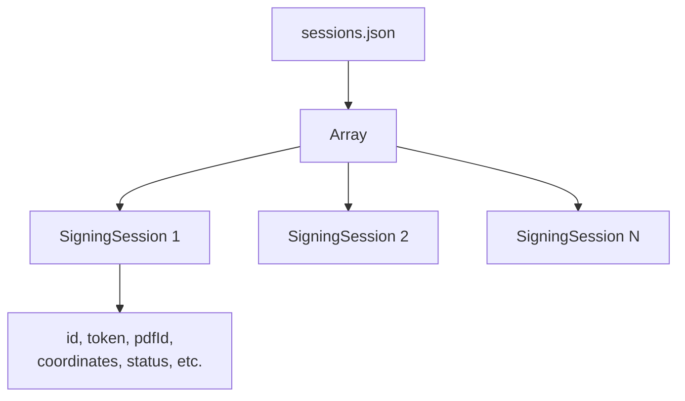

**JSON Format:**
```json
[
  {
    "id": "uuid",
    "token": "tokenstring",
    "pdfId": "uuid",
    "originalPdfPath": "/absolute/path",
    "signedPdfPath": "/absolute/path",
    "guestName": "John Doe",
    "guestEmail": "john@example.com",
    "page": 0,
    "x": 100.0,
    "y": 200.0,
    "width": 200.0,
    "height": 100.0,
    "status": "completed",
    "createdAt": "2024-01-01T00:00:00.000Z",
    "updatedAt": "2024-01-01T00:00:00.000Z"
  }
]
```

---

## Data Flow Model

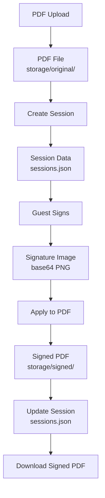

### Data Lifecycle

1. **Upload:** PDF stored as file
2. **Session Creation:** Session metadata stored in JSON
3. **Signing:** Signature image embedded in PDF
4. **Storage:** Signed PDF saved as new file
5. **Update:** Session metadata updated
6. **Download:** Signed PDF retrieved

---

## Signature Image Model

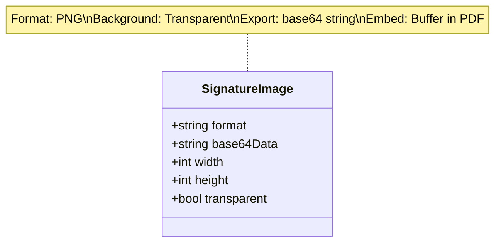

### Signature Image Properties

- **Format:** PNG (required for transparency)
- **Background:** Transparent (`rgba(0, 0, 0, 0)`)
- **Export:** Base64 string from canvas
- **Storage:** Embedded directly in PDF (not stored separately)
- **Size:** Variable (scaled to fit signature box)

---

## Viewport Model

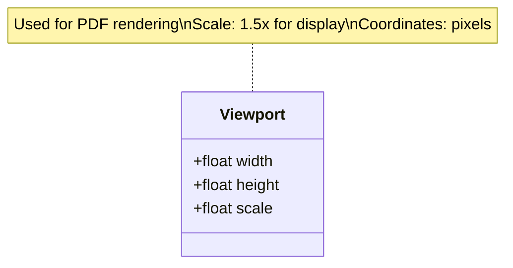

### Viewport Properties

- **Width:** Canvas width in pixels
- **Height:** Canvas height in pixels
- **Scale:** Rendering scale (1.5x for quality)
- **Purpose:** Convert between canvas and PDF coordinates

---

## Data Validation Model

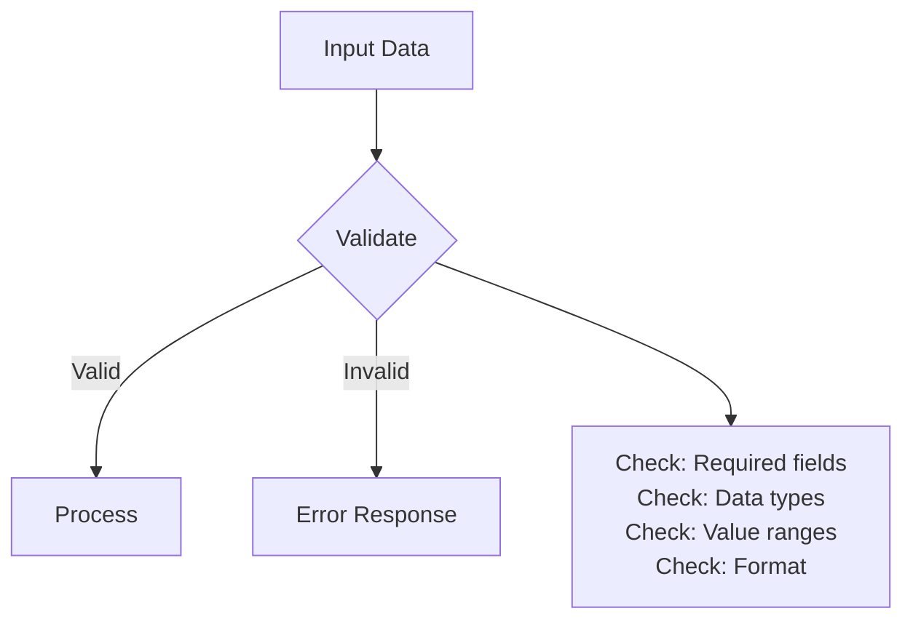

### Validation Rules

**Session Creation:**
- `pdfId`: Must be valid UUID
- `page`: Must be non-negative integer
- `x, y, width, height`: Must be positive numbers
- `guestEmail`: Must be valid email format (if provided)

**File Upload:**
- File must be PDF format
- File size should be reasonable (add limit in production)

---

## Data Relationships

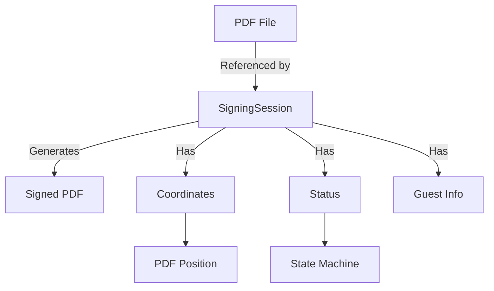

### Relationship Details

- **One PDF → Many Sessions:** One PDF can have multiple signing sessions
- **One Session → One Signed PDF:** Each session produces one signed PDF
- **Session → Coordinates:** Each session has signature position coordinates
- **Session → Status:** Each session follows status state machine

---

## Data Persistence Model

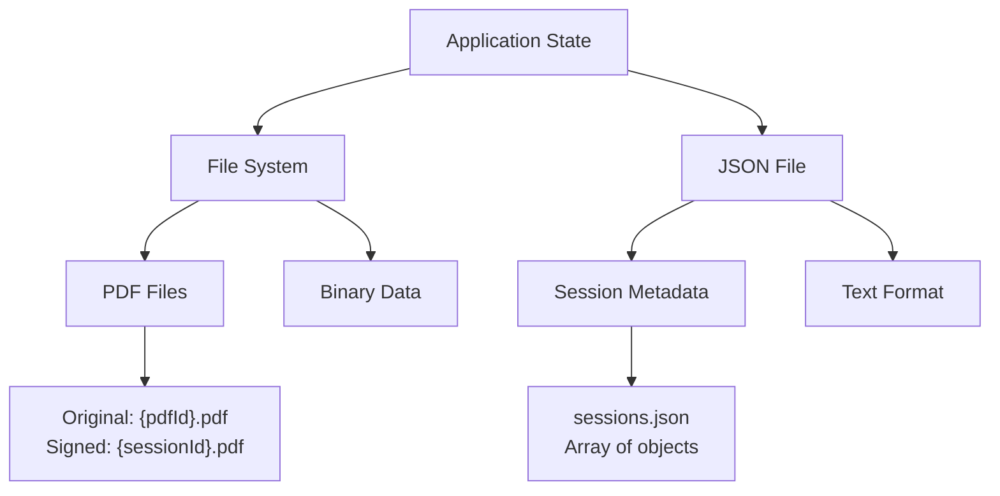

### Persistence Strategy

**Current:**
- PDFs: File system storage
- Sessions: JSON file storage
- No database

**Future:**
- Migrate to database (PostgreSQL, MongoDB)
- Keep PDFs in file system or cloud storage
- Sessions in database tables

---

## Data Access Patterns

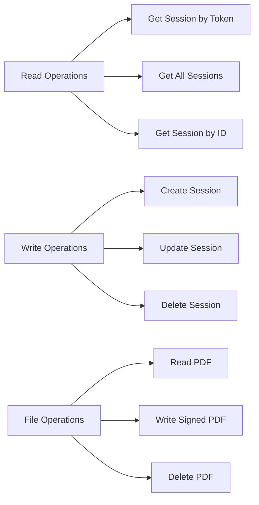

### Access Patterns

**Read:**
- Get session by token (public access)
- Get all sessions (admin)
- Get session by ID (admin)
- Read PDF files (streaming)

**Write:**
- Create session (admin)
- Update session status (guest/admin)
- Delete session (admin)

**File:**
- Upload PDF (admin)
- Generate signed PDF (system)
- Download PDF (admin/guest)

---

## Notes for Developers

### Data Model Best Practices

1. **Type Safety:** Always use TypeScript interfaces
2. **Validation:** Validate all inputs
3. **Consistency:** Use consistent field names
4. **Timestamps:** Always use ISO 8601 format
5. **IDs:** Use UUIDs for all identifiers

### Data Storage Considerations

1. **File Paths:** Never expose absolute paths to frontend
2. **Sessions:** JSON file is simple but not scalable
3. **PDFs:** File system is fine for small scale
4. **Backups:** Implement backup strategy for production

---

## Notes for AI Regeneration

### Required Data Models

1. **SigningSession:** Core entity with all fields
2. **SessionPublicInfo:** Public-facing data structure
3. **CreateSessionRequest:** API request format
4. **CreateSessionResponse:** API response format

### Critical Data Rules

1. **UUIDs:** Always use UUID v4 for IDs
2. **Tokens:** UUID without dashes for public tokens
3. **Coordinates:** Always in PDF points (bottom-left origin)
4. **Status:** Must follow state machine
5. **Timestamps:** ISO 8601 format

### Data Validation

**Always validate:**
- Required fields present
- Data types correct
- Value ranges valid
- Format correct (email, UUID, etc.)

---

## Data Migration Model (Future)

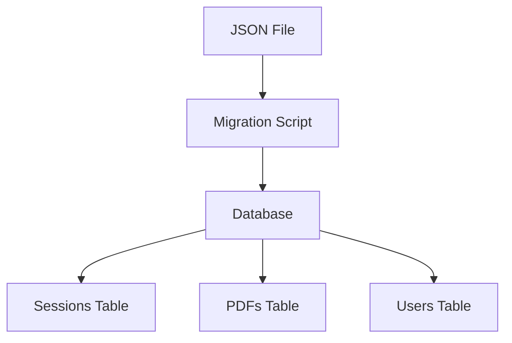

### Future Migration

**From:**
- JSON file for sessions
- File system for PDFs

**To:**
- Database tables
- Cloud storage for PDFs
- Relational data model

---

## Conclusion

This data model documentation provides complete information about:
- **Entities:** SigningSession, PDF (implicit)
- **Relationships:** One-to-many (PDF to Sessions)
- **State Machine:** Session status transitions
- **Storage:** File system and JSON file
- **Validation:** Input validation rules
- **Access Patterns:** Read/write operations

Use this documentation to understand the data structure and implement data operations correctly.

