# System Lifecycle Documentation

## Overview

This document describes system state transitions, lifecycle management, and state machines in ThaiHeavensSignApp.

## Session Lifecycle

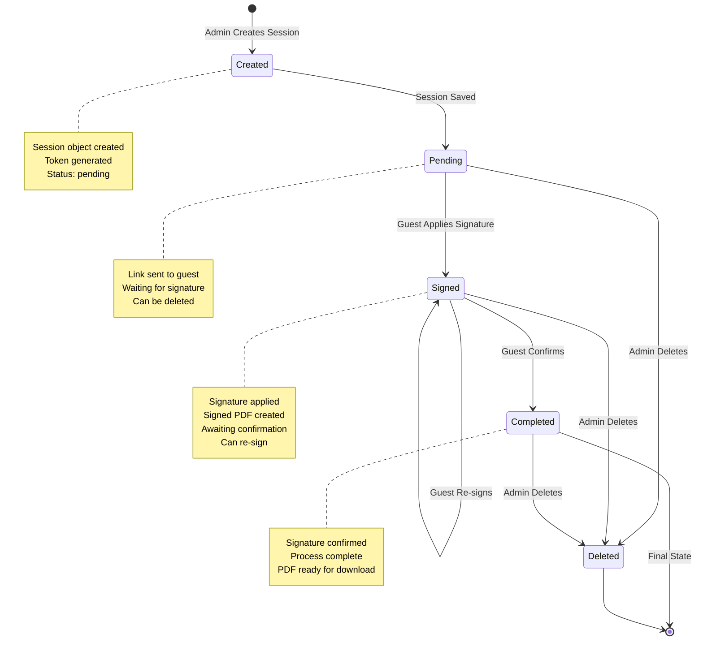

### State Descriptions

**Created:**
- Session object instantiated
- Token generated
- Saved to storage
- Status set to "pending"

**Pending:**
- Session active
- Link sent to guest
- Waiting for guest to sign
- Can be deleted by admin

**Signed:**
- Signature applied to PDF
- Signed PDF file created
- Preview available
- Guest can re-sign (overwrites)
- Can be deleted by admin

**Completed:**
- Signature confirmed
- Session finalized
- PDF available for download
- Cannot be modified
- Can be deleted by admin

**Deleted:**
- Session removed from storage
- Signed PDF deleted (if exists)
- Original PDF preserved
- Final state

---

## PDF Lifecycle

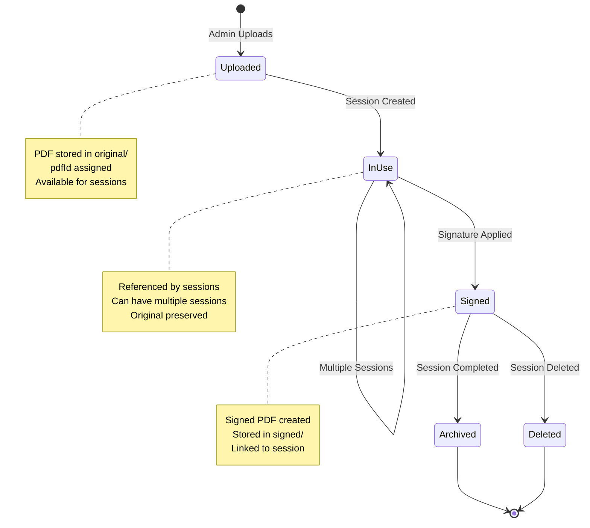

### PDF States

**Uploaded:**
- PDF file stored in `storage/original/`
- UUID assigned as pdfId
- Available for session creation

**InUse:**
- Referenced by one or more sessions
- Original PDF preserved
- Can be used by multiple sessions

**Signed:**
- Signed PDF created in `storage/signed/`
- Linked to specific session
- Original PDF unchanged

**Archived:**
- Session completed
- Signed PDF available for download
- Original PDF still available

**Deleted:**
- Session deleted
- Signed PDF removed
- Original PDF preserved (may be in use by other sessions)

---

## Application Lifecycle

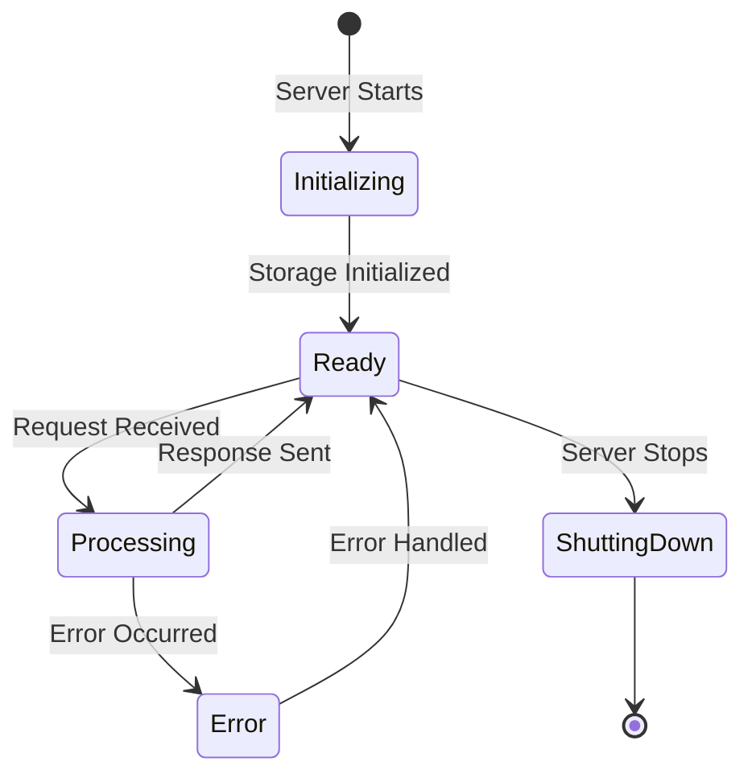

### Application States

**Initializing:**
- Server starting
- Storage directories created
- Routes registered
- Middleware configured

**Ready:**
- Server listening
- Ready to accept requests
- Storage accessible

**Processing:**
- Handling request
- Performing operations
- Generating response

**Error:**
- Error occurred
- Error logged
- Error response sent

**ShuttingDown:**
- Server stopping
- Graceful shutdown
- Resources cleaned up

---

## Request Lifecycle

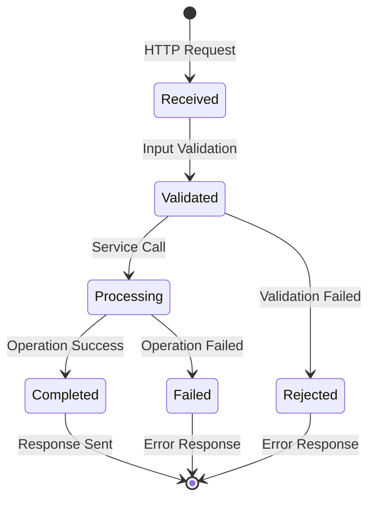

### Request States

**Received:**
- HTTP request received
- Route matched
- Handler invoked

**Validated:**
- Input data validated
- Required fields checked
- Data types verified

**Processing:**
- Business logic executed
- File operations performed
- Data updated

**Completed:**
- Operation successful
- Response prepared
- Response sent

**Rejected:**
- Validation failed
- Error response sent
- Request terminated

**Failed:**
- Operation failed
- Error logged
- Error response sent

---

## File Lifecycle

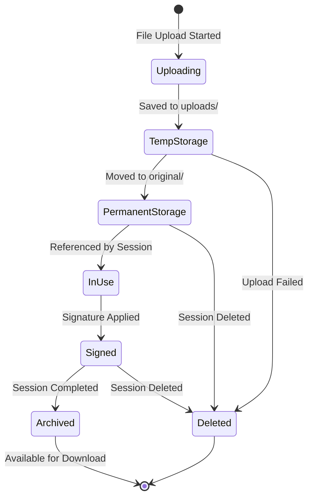

### File States

**Uploading:**
- File being uploaded
- Multer handling
- Temporary storage

**TempStorage:**
- File in `uploads/` directory
- Temporary location
- Will be moved or deleted

**PermanentStorage:**
- File in `storage/original/`
- Permanent location
- Available for sessions

**InUse:**
- Referenced by session(s)
- Cannot be deleted
- Original preserved

**Signed:**
- Signed PDF created
- In `storage/signed/`
- Linked to session

**Archived:**
- Session completed
- Available for download
- Long-term storage

**Deleted:**
- File removed
- Storage freed
- Cannot be recovered

---

## Component Lifecycle (React)

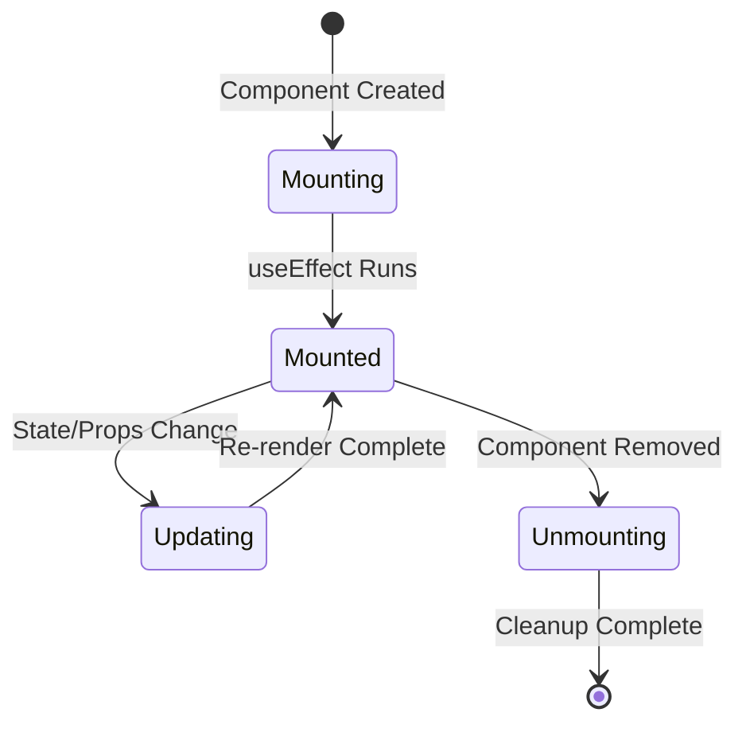

### React Component States

**Mounting:**
- Component created
- Initial render
- useEffect hooks run

**Mounted:**
- Component rendered
- Event listeners active
- Ready for interaction

**Updating:**
- State or props changed
- Re-render triggered
- useEffect dependencies checked

**Unmounting:**
- Component removed
- Cleanup functions run
- Event listeners removed

---

## Storage Lifecycle

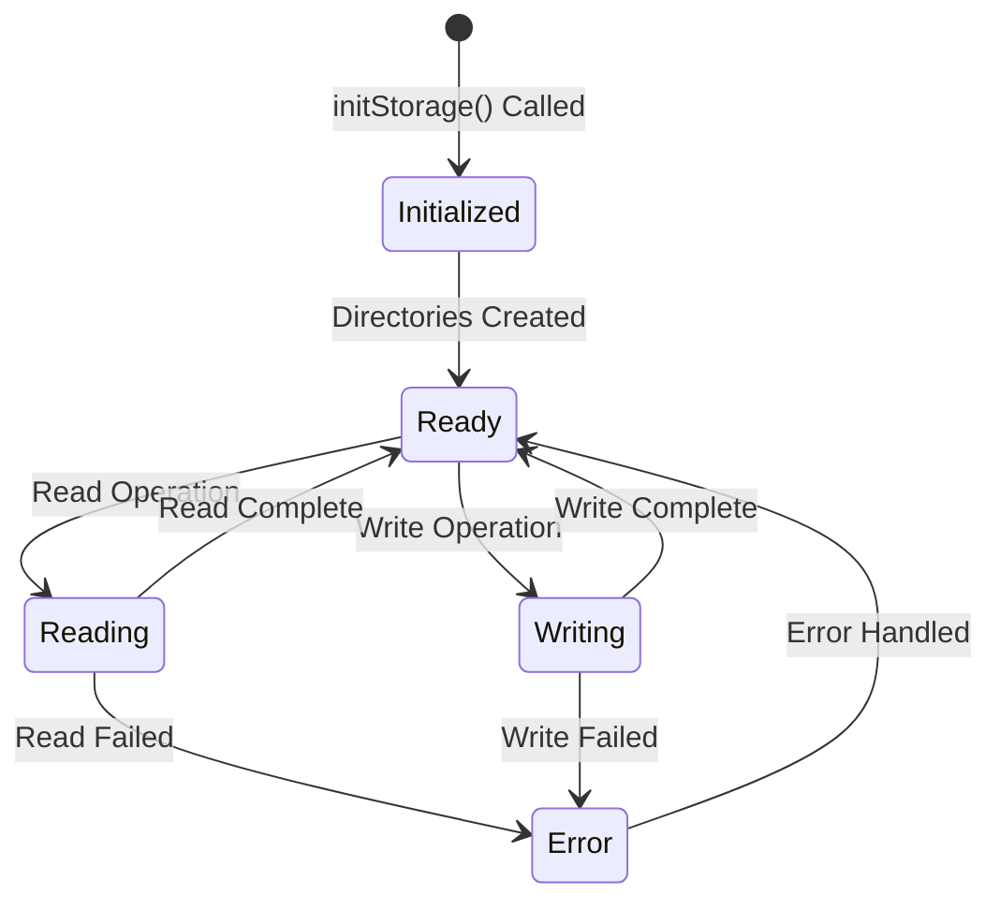

### Storage States

**Initialized:**
- Storage service initialized
- Directories created
- Sessions file created (if needed)

**Ready:**
- Storage accessible
- Ready for operations
- No active operations

**Reading:**
- Reading from file system
- Reading from JSON file
- Operation in progress

**Writing:**
- Writing to file system
- Writing to JSON file
- Operation in progress

**Error:**
- Operation failed
- Error logged
- Error handled

---

## Session Status Transitions

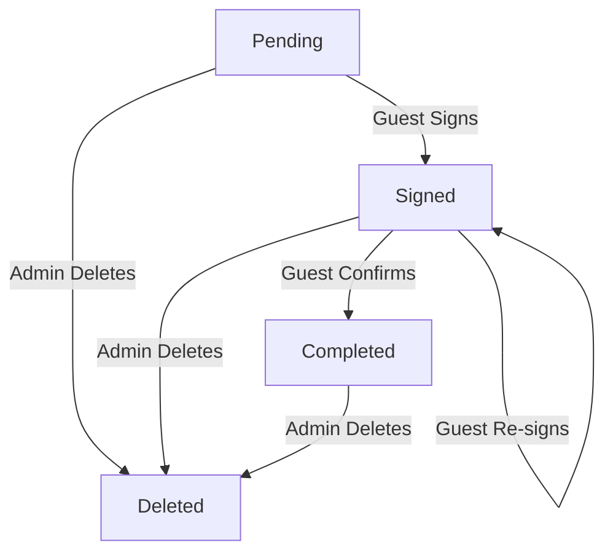

### Transition Rules

**Pending → Signed:**
- Trigger: Guest applies signature
- Action: Create signed PDF
- Update: status = "signed", signedPdfPath set

**Signed → Completed:**
- Trigger: Guest confirms signature
- Action: Mark as completed
- Update: status = "completed"

**Signed → Signed:**
- Trigger: Guest re-signs
- Action: Overwrite signed PDF
- Update: signedPdfPath updated

**Any → Deleted:**
- Trigger: Admin deletes session
- Action: Remove session and files
- Update: Session removed from storage

---

## Error State Lifecycle

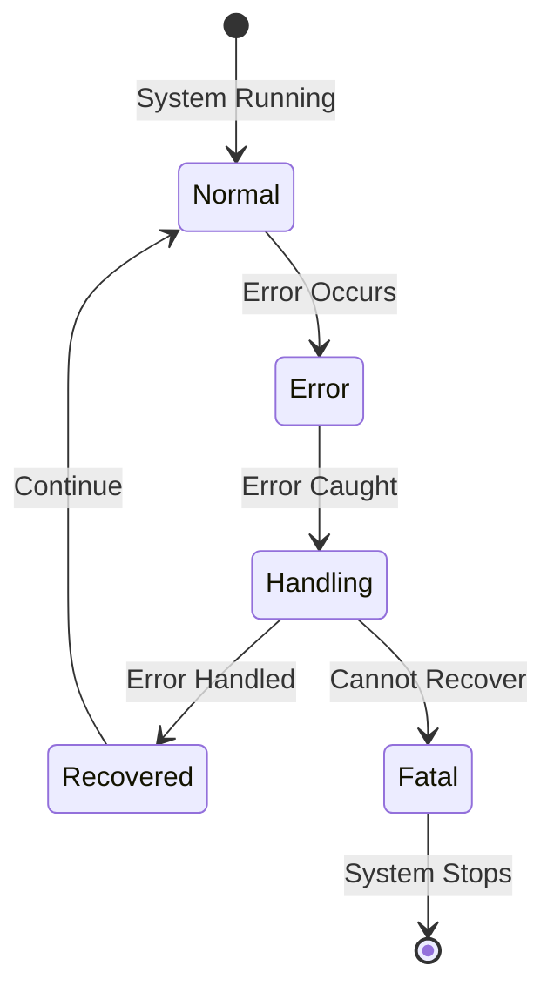

### Error States

**Normal:**
- System operating normally
- No errors
- All operations successful

**Error:**
- Error occurred
- Exception thrown
- Operation failed

**Handling:**
- Error caught
- Error logged
- Recovery attempted

**Recovered:**
- Error handled
- System continues
- User notified

**Fatal:**
- Critical error
- Cannot recover
- System stops

---

## Data Consistency Lifecycle

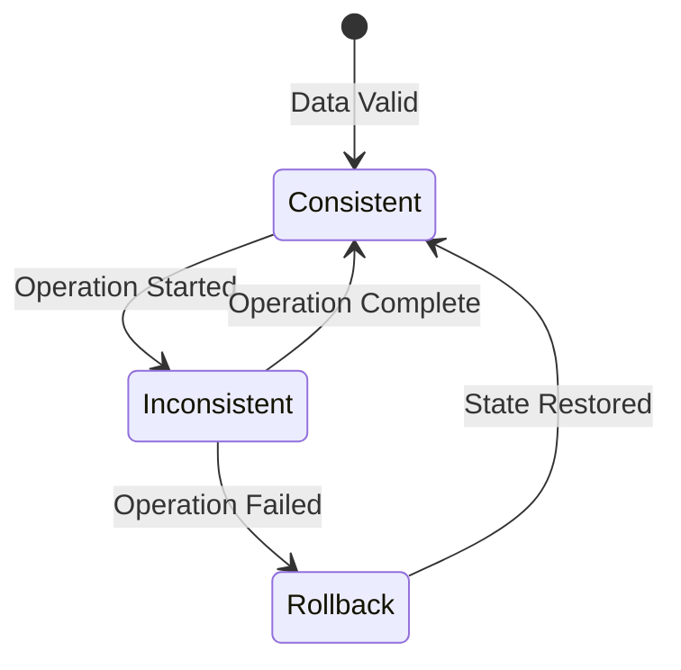

### Consistency States

**Consistent:**
- All data valid
- No conflicts
- Storage synchronized

**Inconsistent:**
- Operation in progress
- Temporary inconsistency
- Will be resolved

**Rollback:**
- Operation failed
- Changes reverted
- State restored

---

## Notes for Developers

### Lifecycle Management

**Best Practices:**
1. **State Transitions:** Always validate state transitions
2. **Cleanup:** Clean up resources on unmount
3. **Error Handling:** Handle errors at each lifecycle stage
4. **Logging:** Log important state changes
5. **Validation:** Validate data at each stage

### State Machine Implementation

**Session Status:**
- Use enum for status values
- Validate transitions
- Update timestamps on state change

**File Operations:**
- Handle file locks
- Clean up temporary files
- Preserve original files

---

## Notes for AI Regeneration

### Required Lifecycle Patterns

1. **Session Lifecycle:** Must implement state machine
2. **File Lifecycle:** Must handle upload → storage → signed
3. **Component Lifecycle:** Must use React hooks correctly
4. **Error Lifecycle:** Must handle errors at each stage

### Critical Lifecycle Rules

1. **State Validation:** Always validate state before transition
2. **Cleanup:** Always clean up resources
3. **Error Recovery:** Always attempt error recovery
4. **Logging:** Always log state changes
5. **Timestamps:** Always update timestamps on state change

---

## Lifecycle Events

### Session Events

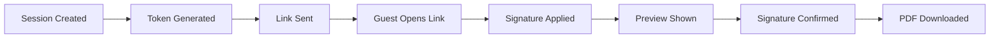

### File Events

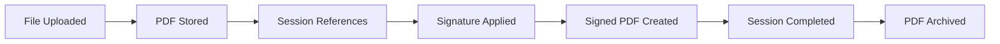

---

## Conclusion

This document provides complete lifecycle documentation for:
- **Session lifecycle:** State transitions and management
- **PDF lifecycle:** File states and operations
- **Application lifecycle:** Server states
- **Component lifecycle:** React component states
- **Error lifecycle:** Error handling and recovery

Use this documentation to understand system behavior and implement proper state management.

