# Guida Visuale - Diagrammi e Flussi

Questa guida contiene diagrammi visuali semplificati per aiutare tutti gli utenti a comprendere come funziona il sistema.

## 🎯 Panoramica del Sistema

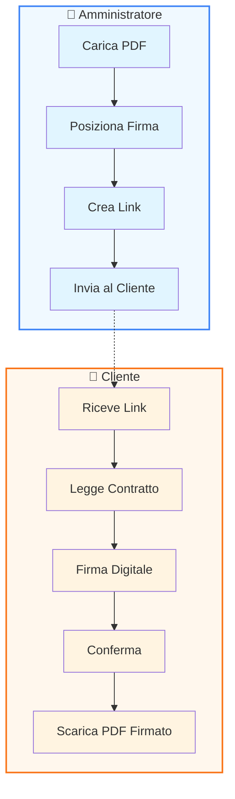

### Cosa fa il Sistema?

1. **L'Amministratore** carica un PDF, decide dove mettere la firma, e crea un link
2. **Il Cliente** riceve il link, legge il contratto, firma, e scarica il PDF firmato

---

## 📋 Processo Completo Passo-Passo

### Per l'Amministratore

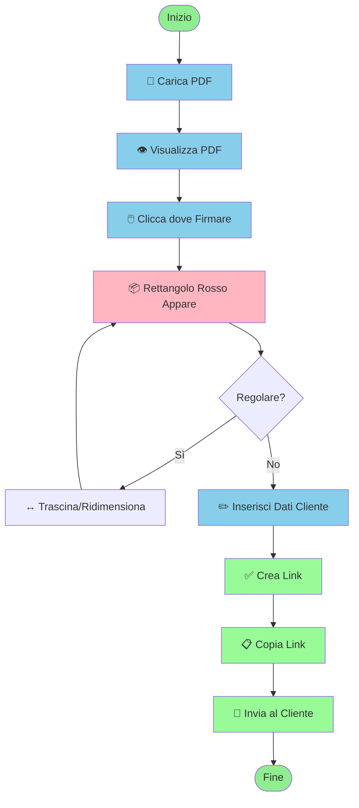

### Per il Cliente

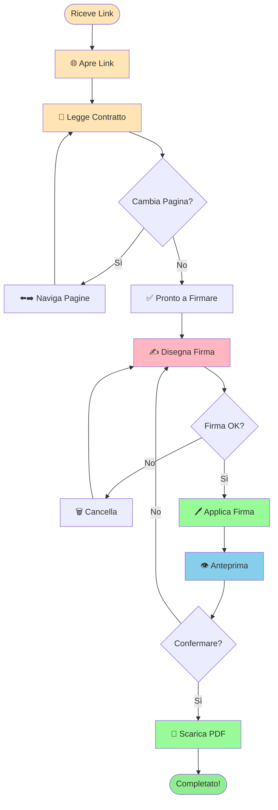

---

## 🎨 Interfaccia Utente - Come Appare

### Pagina Amministratore

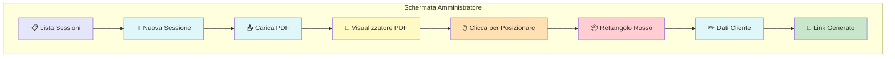

### Pagina Cliente

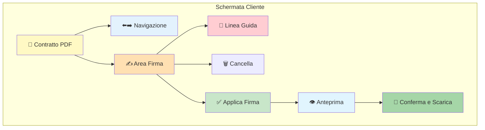

---

## 🔄 Flusso Completo con Stati

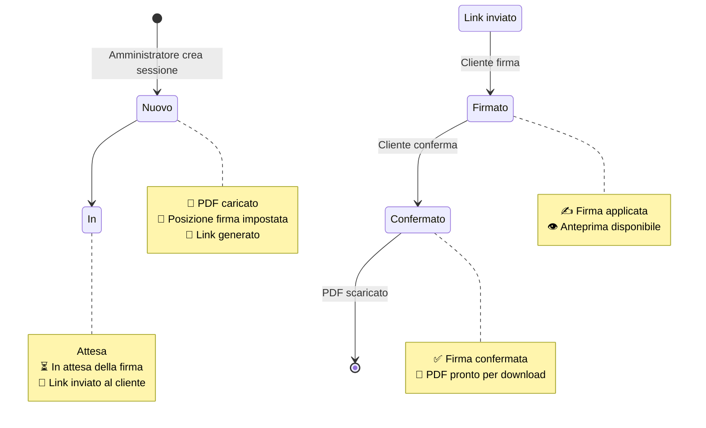

---

## 📱 Funzionalità Mobile

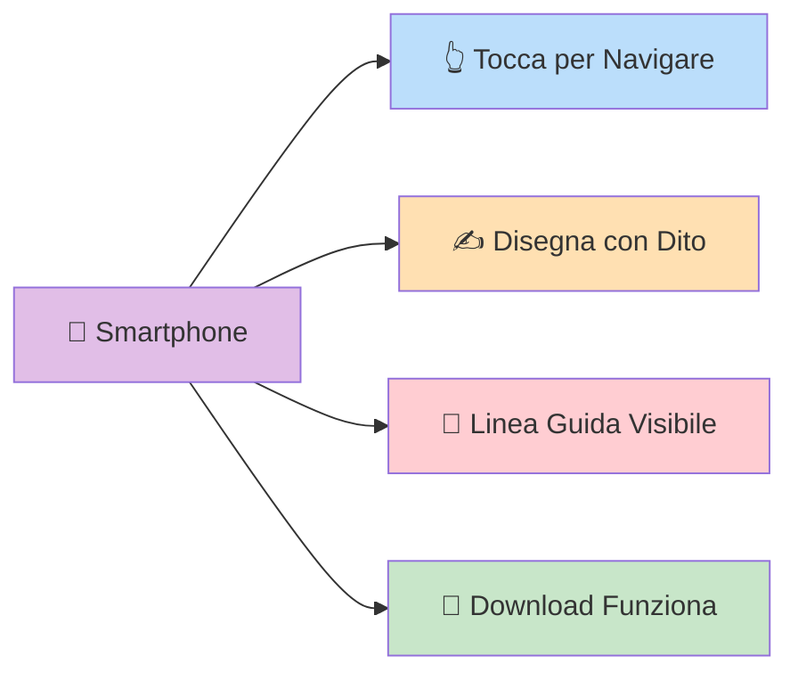

### Caratteristiche Mobile

- ✅ **Touch Support:** Tutto funziona con il tocco
- ✅ **Interfaccia Responsive:** Si adatta allo schermo
- ✅ **Pulsanti Grandi:** Facili da toccare
- ✅ **Canvas Grande:** Area firma comoda
- ✅ **Download:** Funziona su tutti i browser mobile

---

## 🎯 Casi d'Uso Principali

### Caso 1: Contratto di Affitto

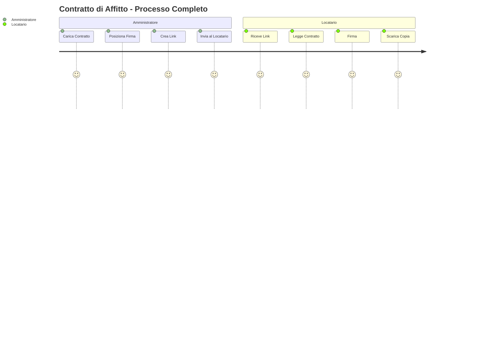

### Caso 2: Documento Legale

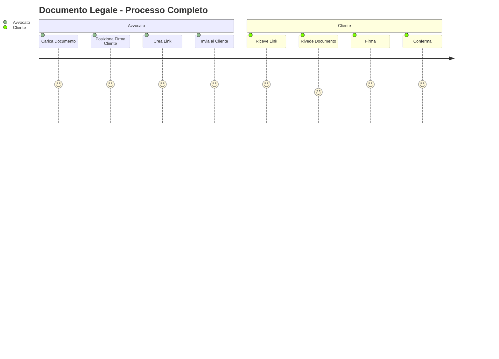

---

## ⚠️ Gestione Errori

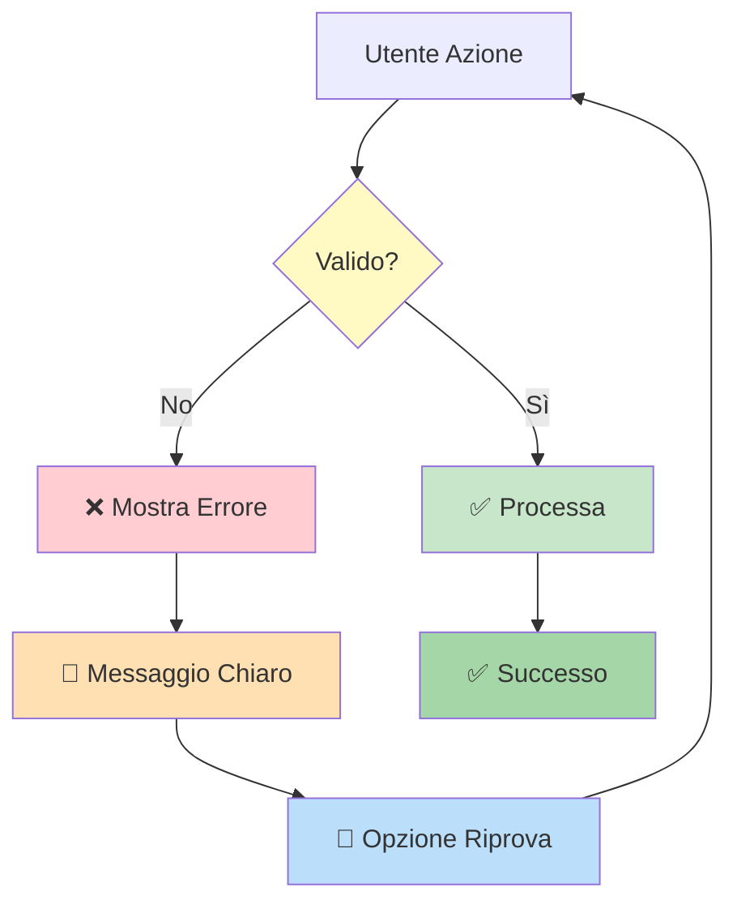

### Tipi di Errori

- **Link Non Valido:** "Il link non è valido o è scaduto"
- **PDF Non Caricato:** "Errore nel caricamento del PDF"
- **Firma Mancante:** "Per favore, disegna la tua firma"
- **Errore di Rete:** "Problema di connessione, riprova"

---

## 🔐 Sicurezza e Privacy

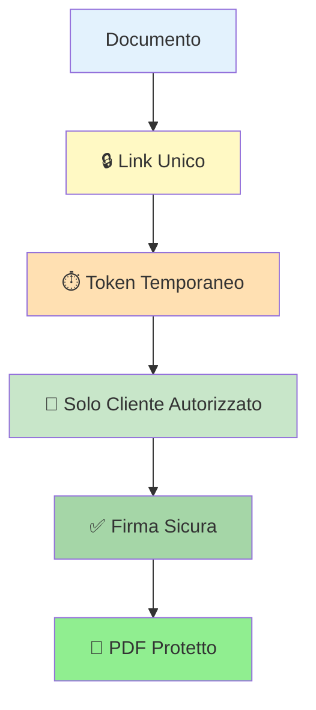

### Caratteristiche di Sicurezza

- 🔒 **Link Unico:** Ogni sessione ha un link unico
- ⏱️ **Token Sicuro:** Token generato casualmente
- 👤 **Accesso Limitato:** Solo chi ha il link può firmare
- ✅ **Firma Verificabile:** La firma è applicata al PDF originale

---

## 📊 Statistiche e Monitoraggio

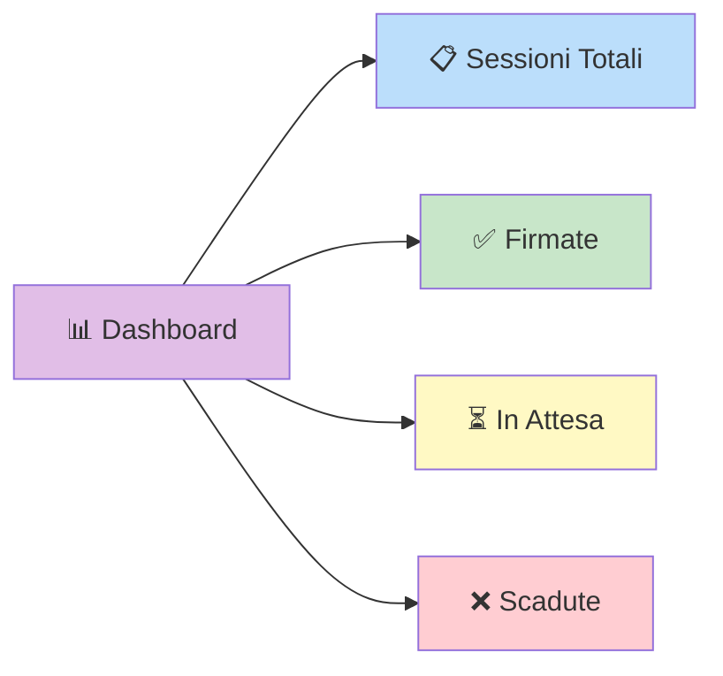

---

## 🎓 Glossario Visuale

### Elementi dell'Interfaccia

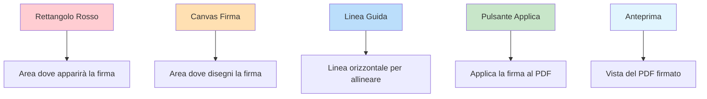

---

## 💡 Suggerimenti per l'Uso

### Per Amministratori

1. **Posizionamento Firma:**
   - Clicca esattamente dove vuoi la firma
   - Usa la linea guida per allineare
   - Puoi trascinare e ridimensionare il rettangolo

2. **Gestione Sessioni:**
   - Tieni traccia dei link inviati
   - Scarica i PDF firmati quando pronti
   - Elimina le sessioni non più necessarie

### Per Clienti

1. **Firma Digitale:**
   - Usa la linea guida per allineare
   - Puoi cancellare e rifare se necessario
   - Controlla l'anteprima prima di confermare

2. **Download:**
   - Il PDF viene scaricato automaticamente
   - Salvalo in un posto sicuro
   - Conservalo per i tuoi archivi

---

## 🎉 Conclusione

Questi diagrammi mostrano come funziona il sistema in modo semplice e visuale. 

- **Blu** = Azioni dell'Amministratore
- **Arancione** = Azioni del Cliente  
- **Verde** = Azioni di Conferma/Successo
- **Rosso** = Aree di Attenzione/Errore

Per informazioni più tecniche, consulta la [Documentazione per Sviluppatori](./DEVELOPER.md).

