# API Flow Documentation

## Overview

This document describes all API interactions in ThaiHeavensSignApp using Mermaid diagrams.

## API Request/Response Flow

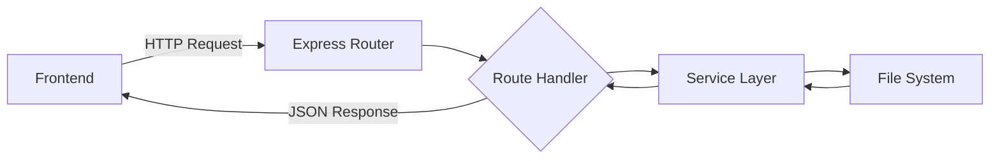

### Request Flow

1. Frontend makes HTTP request
2. Express router matches route
3. Route handler processes request
4. Service layer performs business logic
5. File system operations occur
6. Response flows back through layers

---

## Upload PDF API Flow

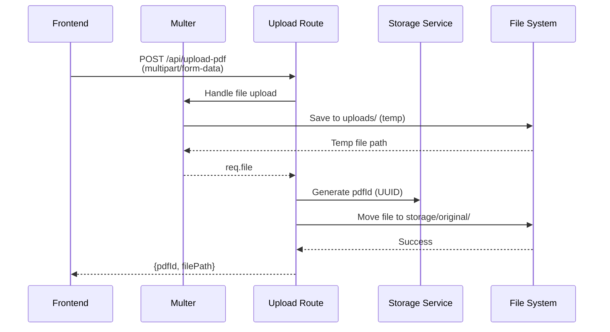

### Upload Endpoint Details

**Endpoint:** `POST /api/upload-pdf`

**Request:**
- Content-Type: `multipart/form-data`
- Body: `file` (PDF file)

**Response:**
```json
{
  "pdfId": "uuid-string",
  "filePath": "/absolute/path/to/file.pdf"
}
```

**Error Responses:**
- `400 Bad Request`: No file uploaded
- `500 Internal Server Error`: File system error

---

## Create Session API Flow

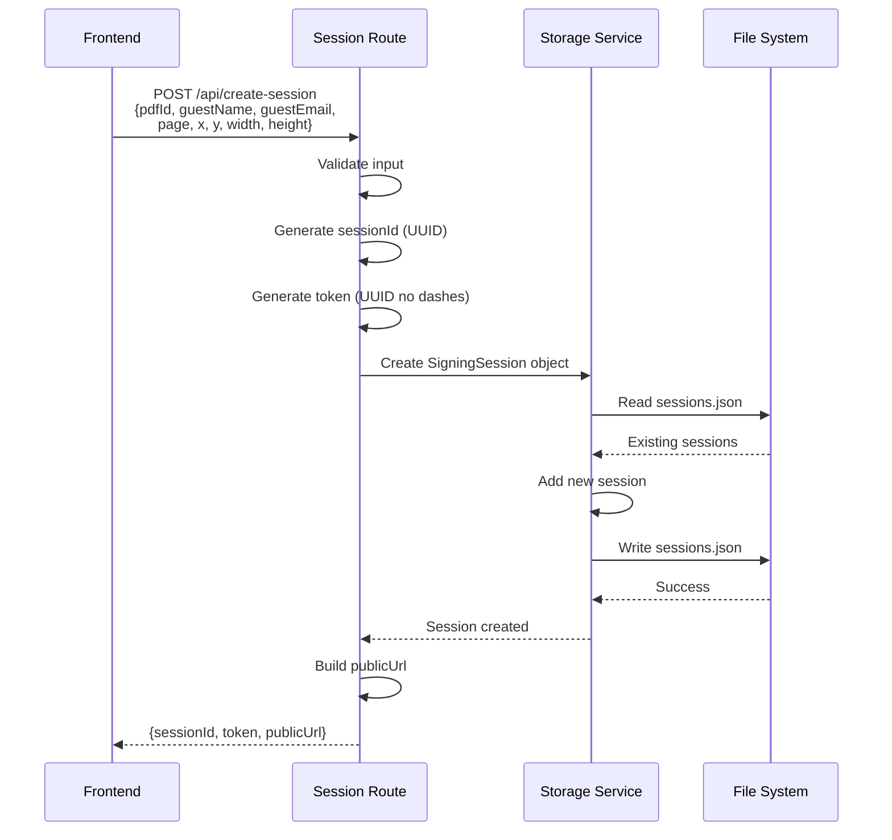

### Create Session Endpoint Details

**Endpoint:** `POST /api/create-session`

**Request Body:**
```json
{
  "pdfId": "uuid",
  "guestName": "John Doe",
  "guestEmail": "john@example.com",
  "page": 0,
  "x": 100.0,
  "y": 200.0,
  "width": 200.0,
  "height": 100.0
}
```

**Response:**
```json
{
  "sessionId": "uuid",
  "token": "tokenstringnodashes",
  "publicUrl": "/sign/tokenstringnodashes"
}
```

**Error Responses:**
- `400 Bad Request`: Missing required fields
- `500 Internal Server Error`: Storage error

---

## Get Session API Flow

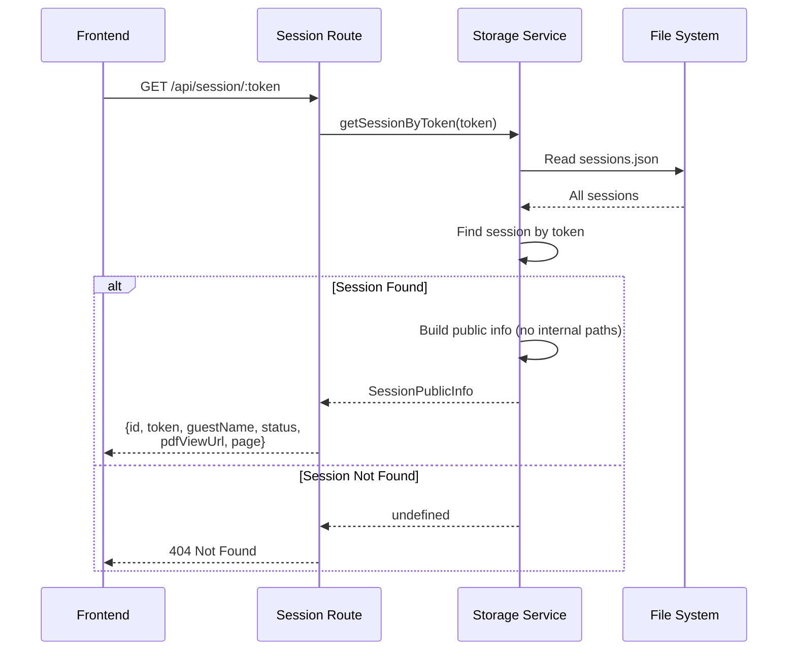

### Get Session Endpoint Details

**Endpoint:** `GET /api/session/:token`

**Response (Success):**
```json
{
  "id": "uuid",
  "token": "tokenstring",
  "guestName": "John Doe",
  "guestEmail": "john@example.com",
  "status": "pending",
  "pdfViewUrl": "/api/pdf/uuid",
  "page": 0
}
```

**Response (Error):**
```json
{
  "error": "Session not found"
}
```
Status: `404 Not Found`

---

## Sign Session API Flow

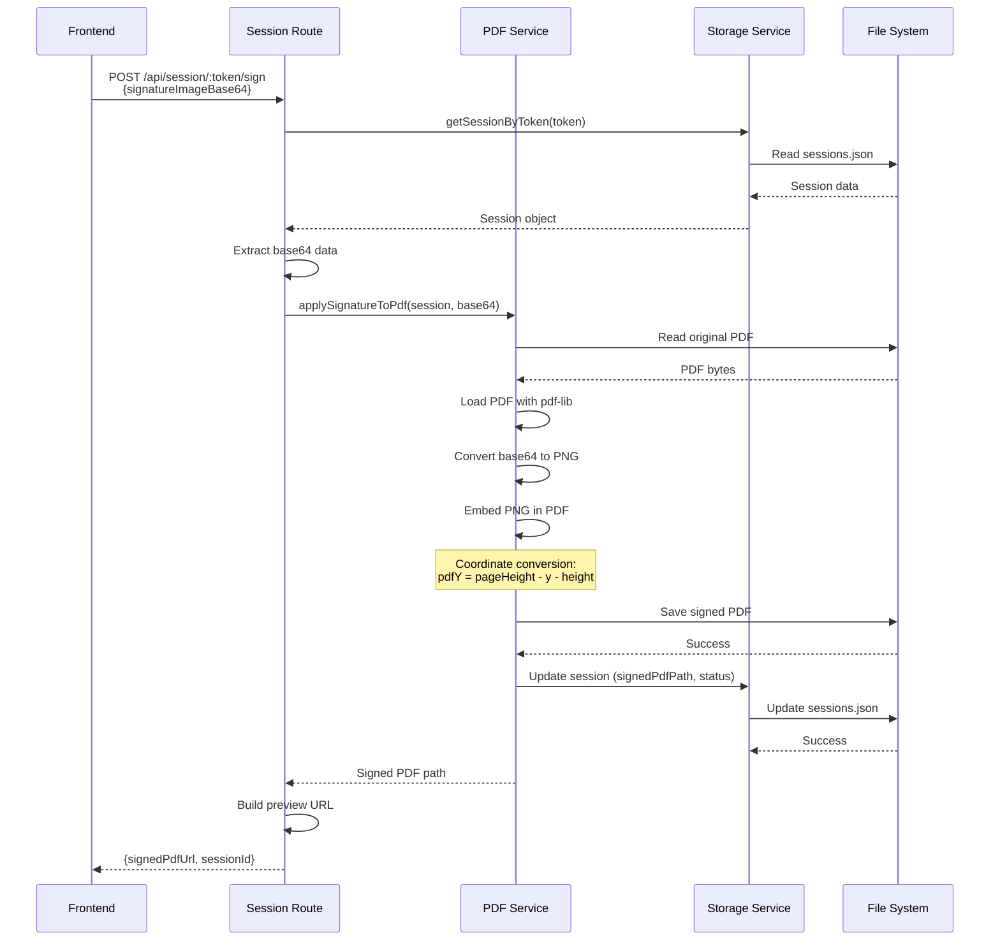

### Sign Session Endpoint Details

**Endpoint:** `POST /api/session/:token/sign`

**Request Body:**
```json
{
  "signatureImageBase64": "data:image/png;base64,iVBORw0KG..."
}
```

**Response:**
```json
{
  "signedPdfUrl": "/api/admin/session/:id/preview-signed",
  "sessionId": "uuid"
}
```

**Error Responses:**
- `404 Not Found`: Session not found
- `500 Internal Server Error`: PDF processing error

---

## Confirm Session API Flow

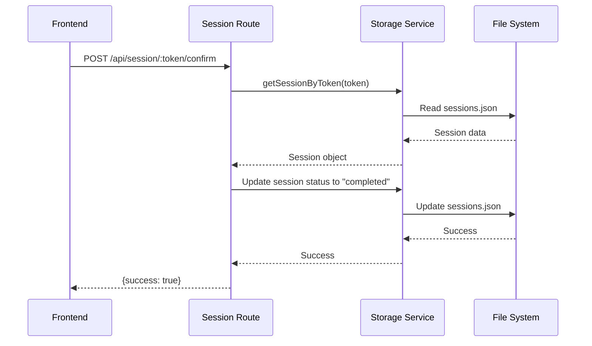

### Confirm Session Endpoint Details

**Endpoint:** `POST /api/session/:token/confirm`

**Response:**
```json
{
  "success": true
}
```

**Error Responses:**
- `404 Not Found`: Session not found
- `500 Internal Server Error`: Storage error

---

## Admin API Flows

### Get All Sessions

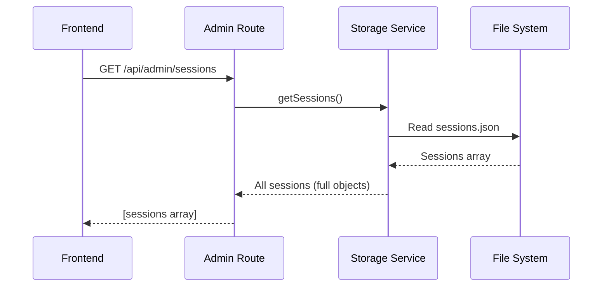

### Download Signed PDF

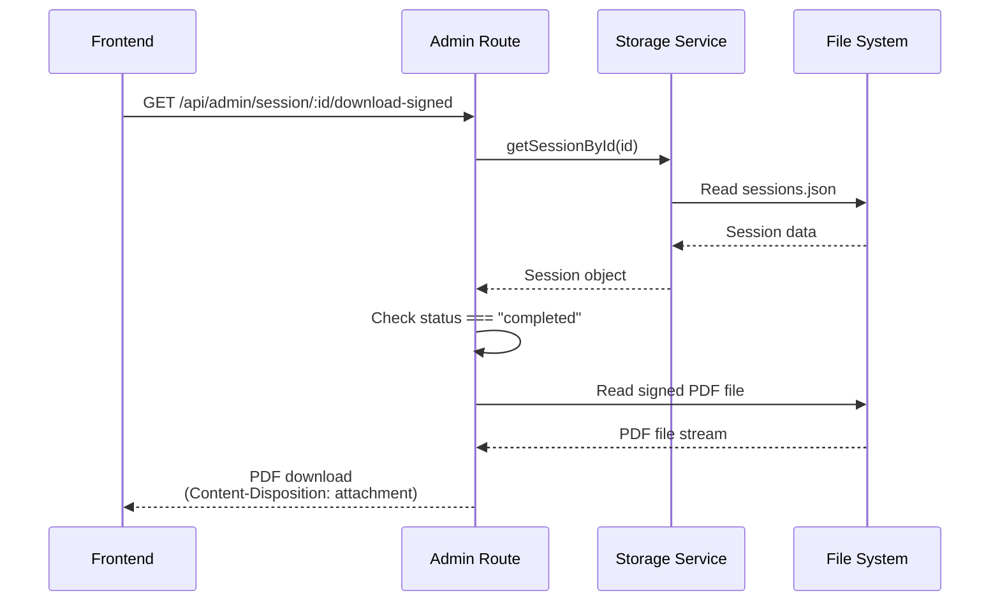

### Delete Session

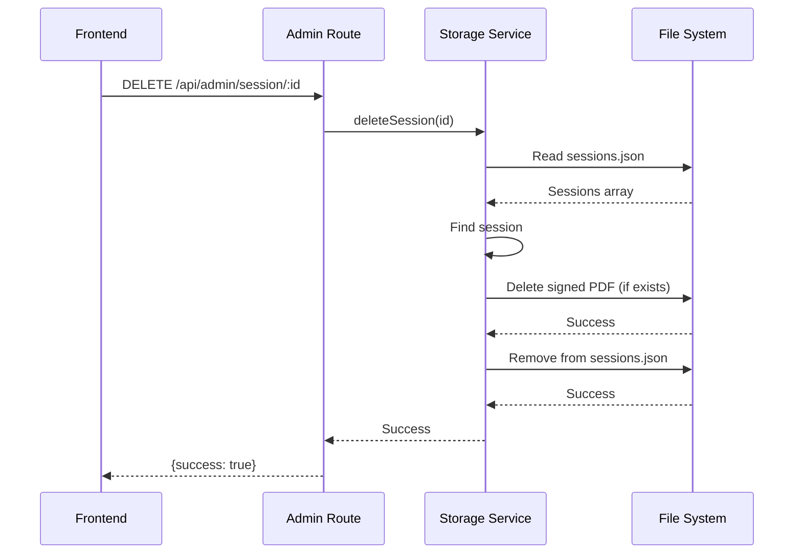

---

## PDF Streaming API Flow

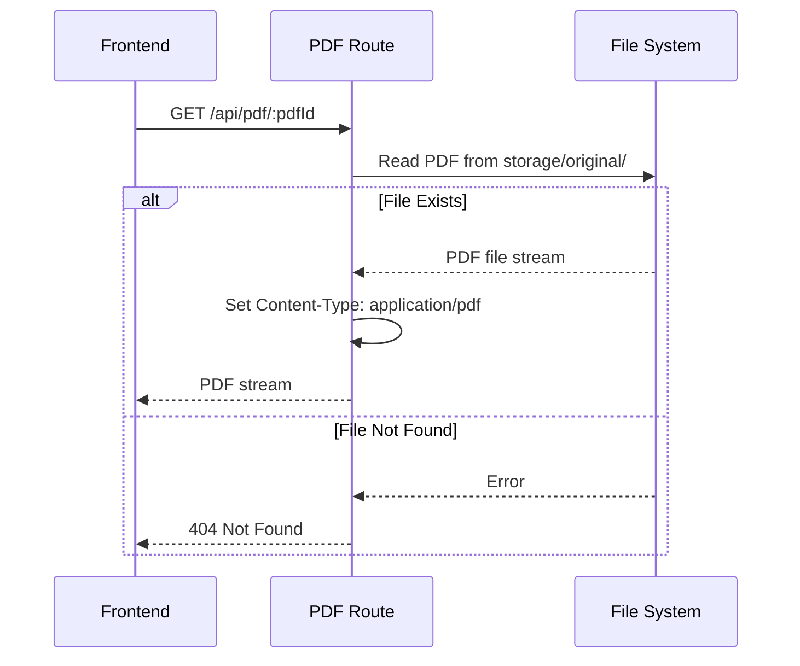

### PDF Streaming Details

**Endpoint:** `GET /api/pdf/:pdfId`

**Response:**
- Content-Type: `application/pdf`
- PDF file stream

**Error Response:**
- `404 Not Found`: PDF file not found

---

## Calibration API Flow

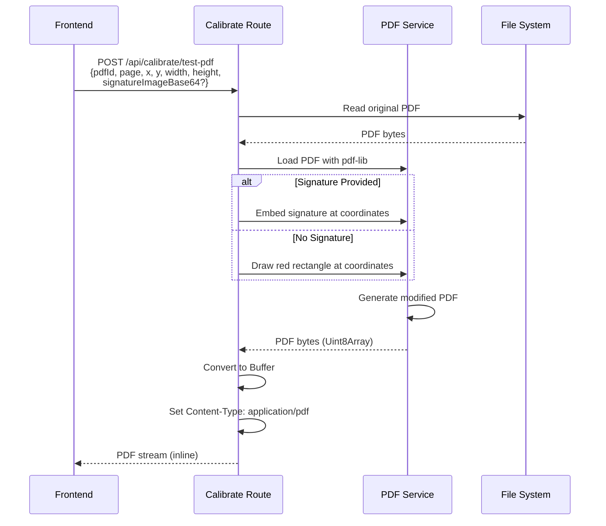

### Calibration Endpoint Details

**Endpoint:** `POST /api/calibrate/test-pdf`

**Request Body:**
```json
{
  "pdfId": "uuid",
  "page": 0,
  "x": 100.0,
  "y": 200.0,
  "width": 200.0,
  "height": 100.0,
  "signatureImageBase64": "optional-base64-string"
}
```

**Response:**
- Content-Type: `application/pdf`
- PDF file stream with test box or signature

---

## API Error Handling Flow

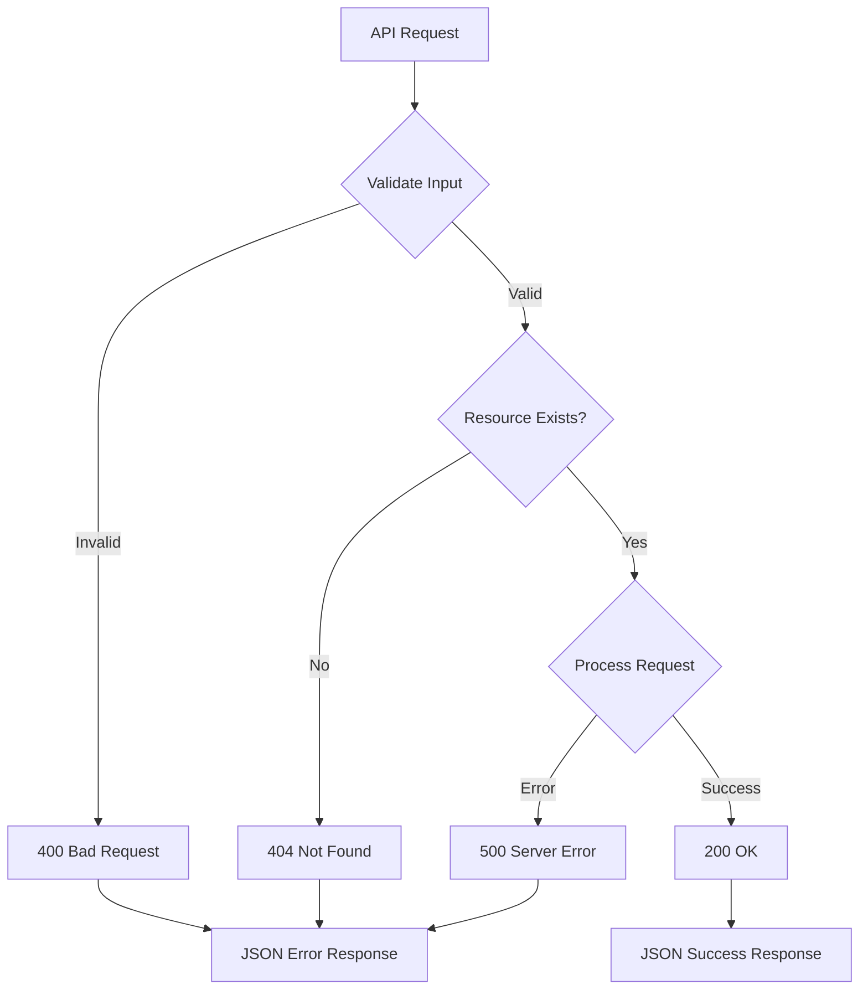

### Error Response Format

All errors return JSON:
```json
{
  "error": "Error message"
}
```

**Status Codes:**
- `200 OK`: Success
- `400 Bad Request`: Invalid input
- `404 Not Found`: Resource not found
- `500 Internal Server Error`: Server error

---

## API Authentication Flow (Future)

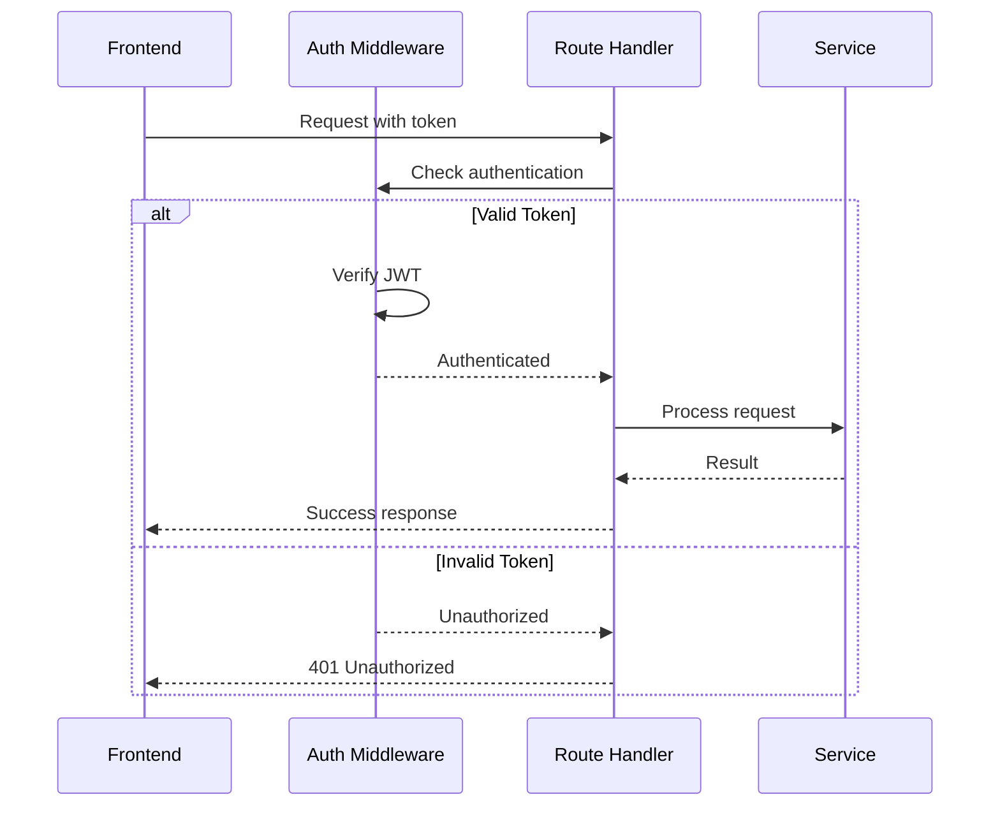

### Future Authentication

**Current State:** No authentication
**Future:** Add JWT-based authentication for admin routes

---

## API Rate Limiting Flow (Future)

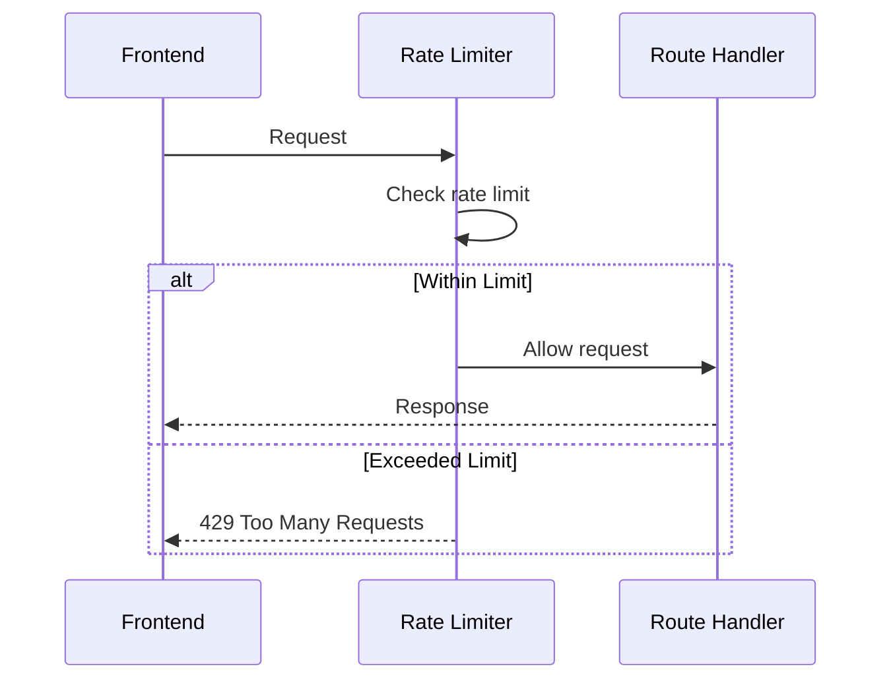

### Future Rate Limiting

**Current State:** No rate limiting
**Future:** Add rate limiting to prevent abuse

---

## Notes for Developers

### API Design Principles

1. **RESTful:** Use standard HTTP methods
2. **JSON:** All responses in JSON format
3. **Error Handling:** Consistent error format
4. **Status Codes:** Use appropriate HTTP status codes
5. **Validation:** Validate all inputs

### API Security

**Current:**
- No authentication
- CORS enabled for all origins
- No rate limiting

**Production Requirements:**
- Add authentication
- Restrict CORS
- Implement rate limiting
- Validate file uploads
- Sanitize inputs

---

## Notes for AI Regeneration

### Required API Patterns

1. **Upload:** Multipart form data handling
2. **Session Management:** CRUD operations
3. **PDF Operations:** File streaming
4. **Error Handling:** Consistent error responses

### API Contract

**Always:**
- Return JSON for errors
- Use appropriate status codes
- Validate input data
- Handle file operations safely
- Never expose internal paths

**Never:**
- Return internal file paths to frontend
- Skip input validation
- Expose sensitive data
- Allow direct file system access

---

## API Endpoint Summary

| Method | Endpoint | Purpose | Auth Required |
|--------|----------|---------|---------------|
| POST | `/api/upload-pdf` | Upload PDF | No |
| POST | `/api/create-session` | Create session | No |
| GET | `/api/session/:token` | Get session | No |
| POST | `/api/session/:token/sign` | Apply signature | No |
| POST | `/api/session/:token/confirm` | Confirm signature | No |
| GET | `/api/admin/sessions` | List sessions | No* |
| GET | `/api/admin/session/:id/download-signed` | Download PDF | No* |
| GET | `/api/admin/session/:id/preview-signed` | Preview PDF | No* |
| DELETE | `/api/admin/session/:id` | Delete session | No* |
| GET | `/api/pdf/:pdfId` | Stream PDF | No |
| POST | `/api/calibrate/test-pdf` | Test PDF | No |

*Currently no auth, but should be added in production

---

## Conclusion

This document provides complete API flow documentation. All endpoints follow RESTful principles and return consistent JSON responses. Error handling is implemented at each layer, and file operations are performed safely.


