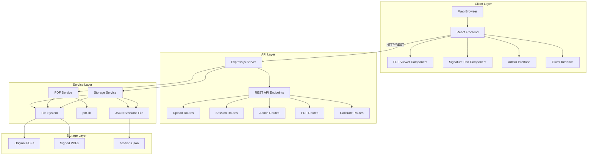
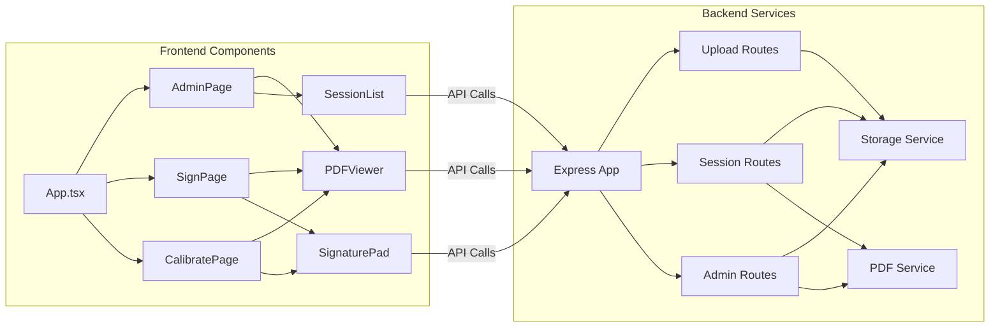
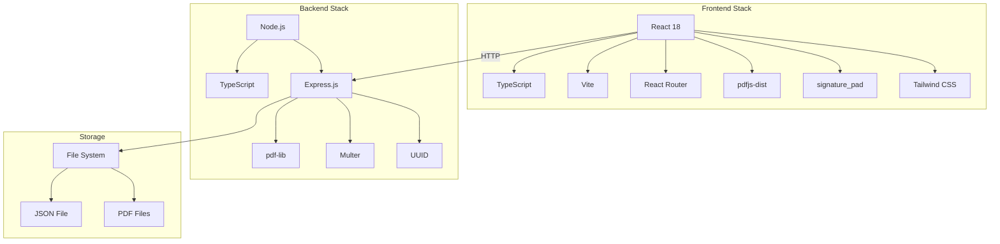
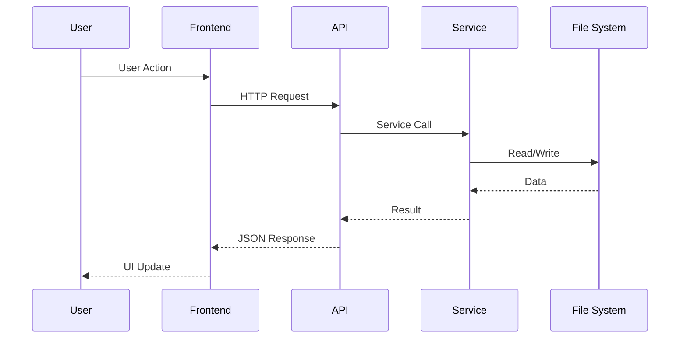
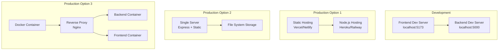
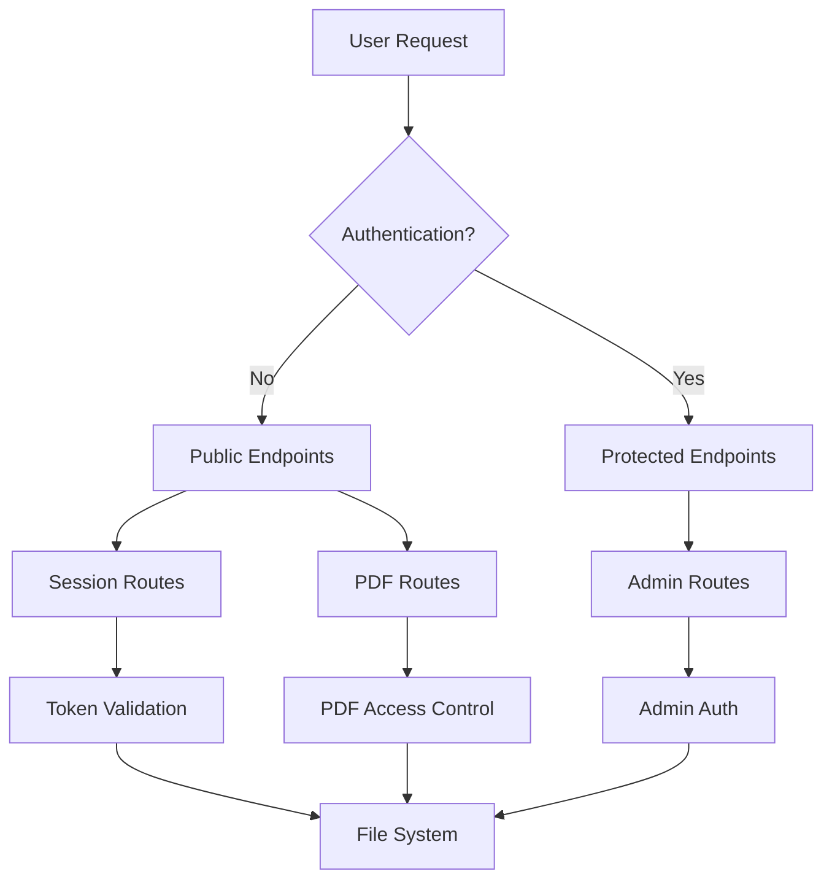
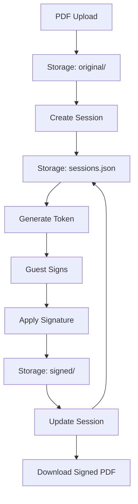
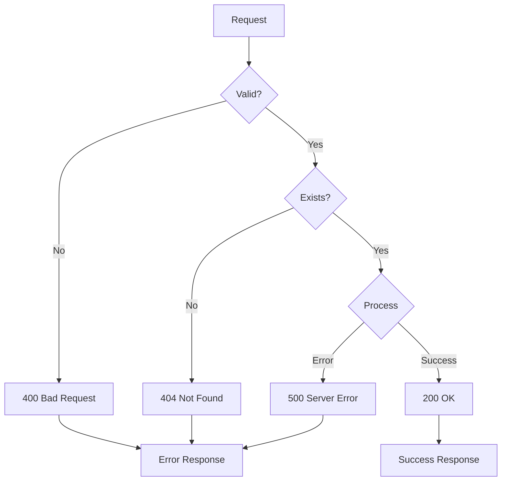
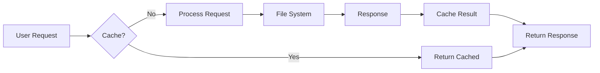
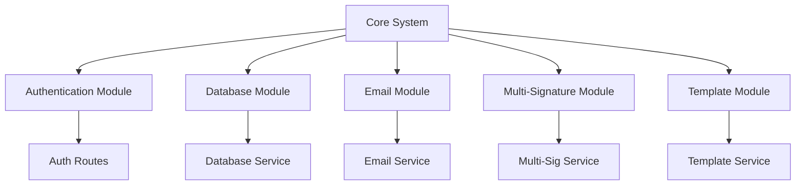

# System Architecture

## Overview

This document describes the high-level architecture of ThaiHeavensSignApp using Mermaid diagrams.

## System Architecture Diagram



### How to Read This Diagram

- **Client Layer:** User-facing React application running in the browser
- **API Layer:** Express.js backend handling HTTP requests
- **Service Layer:** Business logic for file operations and PDF manipulation
- **Storage Layer:** File system storage for PDFs and session data

### Architecture Notes

**Separation of Concerns:**
- Frontend handles UI/UX and user interactions
- Backend handles business logic and file operations
- Services encapsulate specific functionality (storage, PDF manipulation)

**Data Flow:**
1. User interacts with React frontend
2. Frontend makes API calls to Express backend
3. Backend uses services to process requests
4. Services read/write to file system
5. Responses flow back through the layers

---

## Component Architecture



### Component Relationships

- **App.tsx:** Root component with routing
- **Pages:** Top-level page components
- **Components:** Reusable UI components
- **Services:** Backend business logic

---

## Technology Stack Architecture



### Stack Explanation

**Frontend:**
- React for UI components
- TypeScript for type safety
- Vite for fast development and building
- pdfjs-dist for PDF rendering
- signature_pad for signature drawing

**Backend:**
- Node.js runtime
- Express.js for HTTP server
- pdf-lib for PDF manipulation
- Multer for file uploads
- UUID for ID generation

---

## Request Flow Architecture



### Flow Explanation

1. User performs action (click, upload, etc.)
2. Frontend component handles event
3. API client makes HTTP request
4. Express route receives request
5. Route calls appropriate service
6. Service interacts with file system
7. Response flows back through layers
8. Frontend updates UI

---

## Notes for Developers

### Key Architectural Decisions

1. **Monorepo Structure:** Separate frontend and backend for clear separation
2. **RESTful API:** Standard HTTP methods for clear communication
3. **File-based Storage:** Simple JSON file for sessions (can be upgraded to database)
4. **Stateless Backend:** Each request is independent
5. **Component-based Frontend:** Reusable React components

### Scalability Considerations

- **Current:** Single server, file-based storage
- **Future:** Can scale horizontally with database
- **Frontend:** Can be deployed to CDN
- **Backend:** Can be containerized with Docker

---

## Notes for AI Regeneration

### Critical Architecture Rules

1. **Always maintain separation:** Frontend and backend are separate applications
2. **API contract:** Frontend communicates only via REST API
3. **No direct file access:** Frontend never accesses file system directly
4. **Coordinate conversion:** Must happen in both frontend and backend
5. **State management:** Frontend uses React state, backend uses file system

### Required Components

**Frontend:**
- Router (React Router)
- PDF Viewer (pdfjs-dist)
- Signature Pad (signature_pad)
- API Client (fetch/axios)

**Backend:**
- Express server
- Route handlers
- Storage service
- PDF service

### File Structure Requirements

```
backend/src/
  ├── index.ts (Express app)
  ├── routes/ (API endpoints)
  └── services/ (Business logic)

frontend/src/
  ├── App.tsx (Router)
  ├── pages/ (Page components)
  └── components/ (Reusable components)
```

---

## Deployment Architecture



### Deployment Options

1. **Separate Hosting:** Frontend on static hosting, backend on Node.js hosting
2. **Single Server:** Express serves both frontend and backend
3. **Containerized:** Docker containers with reverse proxy

---

## Security Architecture



### Current Security Model

- **Public:** Guest signing endpoints (token-based)
- **Protected:** Admin endpoints (currently no auth - add in production)
- **File Access:** Controlled via API, no direct file system access

### Production Security Requirements

- Add authentication middleware
- Implement rate limiting
- Validate file uploads
- Use HTTPS/SSL
- Restrict CORS origins
- Add input validation

---

## Data Flow Architecture



### Data Lifecycle

1. **Upload:** PDF stored in `original/` directory
2. **Session Creation:** Session data stored in JSON file
3. **Signing:** Signature applied, signed PDF stored in `signed/`
4. **Completion:** Session status updated, PDF available for download

---

## Error Handling Architecture



### Error Flow

- **Validation Errors:** 400 Bad Request
- **Not Found:** 404 Not Found
- **Server Errors:** 500 Internal Server Error
- **Success:** 200 OK with data

---

## Performance Architecture



### Performance Considerations

**Current:**
- No caching (can be added)
- Direct file system access
- JSON file reads on each request

**Optimization Opportunities:**
- Add Redis for session caching
- Implement file streaming
- Add database for faster queries
- Use CDN for frontend assets

---

## Extension Points



### Extensibility

The architecture supports adding:
- Authentication system
- Database integration
- Email notifications
- Multiple signatures per session
- PDF templates
- Custom workflows

---

## Conclusion

This architecture provides a solid foundation for a digital signing application. It's designed to be:
- **Simple:** Easy to understand and maintain
- **Extensible:** Can add features without major refactoring
- **Scalable:** Can grow from file-based to database-backed
- **Secure:** Clear separation of concerns (add auth in production)


