# Deployment Documentation

## Overview

This document describes how the ThaiHeavensSignApp system runs in production, including deployment architectures, configurations, and operational procedures.

## Deployment Architecture

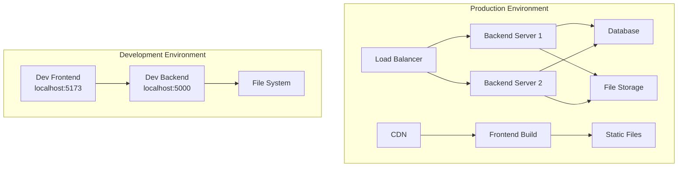

### Deployment Models

**Option 1: Railway (Cloud Platform)**
- Full-stack deployment on Railway
- Automatic builds from GitHub
- Pay-as-you-go pricing ($15-30/month)
- See: [Deploy on Railway Guide](../DEPLOY.md)

**Option 2: RunCloud + UpCloud (VPS)**
- Deploy on your own VPS server
- Managed via RunCloud dashboard
- Very cost-effective ($0-8/month if you already have a server)
- See: [Deploy on RunCloud Guide](../DEPLOY_RUNCLOUD.md)

**Option 3: Separate Hosting**
- Frontend: Static hosting (Vercel, Netlify)
- Backend: Node.js hosting (Heroku, Railway)
- Database: Cloud database
- Storage: Cloud storage (S3, etc.)

**Option 4: Single Server**
- Express serves frontend and backend
- File system storage
- Single deployment

**Option 5: Containerized**
- Docker containers
- Reverse proxy (Nginx)
- Container orchestration

---

## Development Deployment

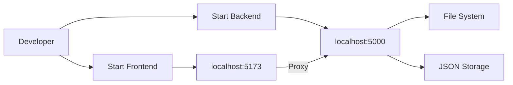

### Development Setup

**Backend:**
```bash
cd backend
npm install
npm run dev
```

**Frontend:**
```bash
cd frontend
npm install
npm run dev
```

**Access:**
- Frontend: http://localhost:5173
- Backend: http://localhost:5000
- Documentation: http://localhost:5173/docs

---

## Production Deployment - Option 1: Separate Hosting

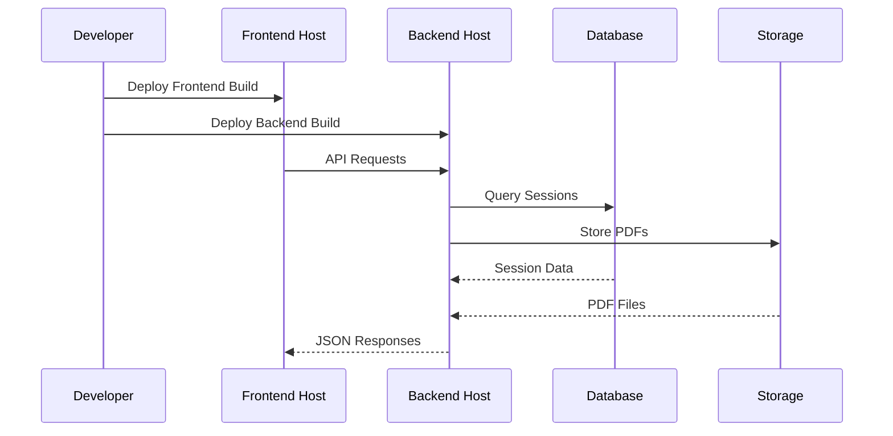

### Separate Hosting Steps

**Frontend Deployment:**
1. Build frontend: `cd frontend && npm run build`
2. Deploy `dist/` folder to static hosting
3. Configure API base URL
4. Set up custom domain (optional)

**Backend Deployment:**
1. Build backend: `cd backend && npm run build`
2. Deploy to Node.js hosting
3. Set environment variables
4. Configure CORS for frontend domain
5. Set up database (replace JSON file)
6. Configure cloud storage (replace file system)

---

## Production Deployment - Option 2: Single Server

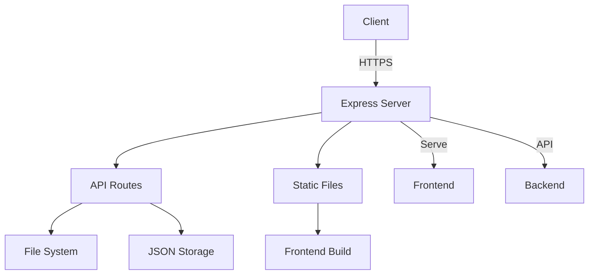

### Single Server Setup

**Express Configuration:**
```typescript
// Serve frontend build
app.use(express.static(path.join(__dirname, '../../frontend/dist')));

// API routes
app.use('/api', routes);

// Fallback to frontend for SPA routing
app.get('*', (req, res) => {
  res.sendFile(path.join(__dirname, '../../frontend/dist/index.html'));
});
```

**Deployment:**
1. Build both frontend and backend
2. Deploy to single server
3. Configure reverse proxy (Nginx)
4. Set up SSL/HTTPS
5. Configure process manager (PM2)

---

## Production Deployment - Option 3: Containerized

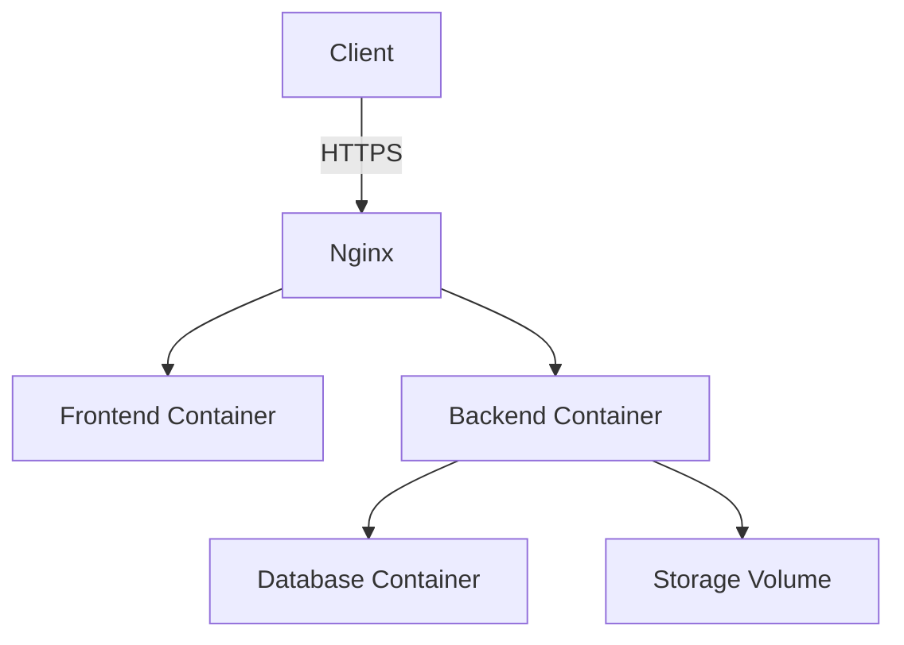

### Docker Setup

**Dockerfile (Backend):**
```dockerfile
FROM node:18-alpine
WORKDIR /app
COPY package*.json ./
RUN npm ci --only=production
COPY dist ./dist
EXPOSE 5000
CMD ["node", "dist/index.js"]
```

**Dockerfile (Frontend):**
```dockerfile
FROM nginx:alpine
COPY dist /usr/share/nginx/html
COPY nginx.conf /etc/nginx/nginx.conf
EXPOSE 80
CMD ["nginx", "-g", "daemon off;"]
```

**Docker Compose:**
```yaml
version: '3.8'
services:
  backend:
    build: ./backend
    ports:
      - "5000:5000"
    volumes:
      - ./storage:/app/storage
    environment:
      - PORT=5000
      
  frontend:
    build: ./frontend
    ports:
      - "80:80"
    depends_on:
      - backend
```

---

## Environment Configuration

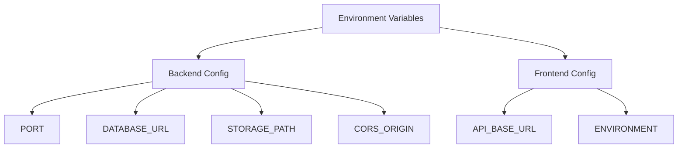

### Environment Variables

**Backend:**
- `PORT`: Server port (default: 5000)
- `NODE_ENV`: Environment (development/production)
- `CORS_ORIGIN`: Allowed frontend origin
- `DATABASE_URL`: Database connection string (if using DB)
- `STORAGE_PATH`: File storage path

**Frontend:**
- `VITE_API_BASE_URL`: Backend API URL
- `VITE_ENVIRONMENT`: Environment name

---

## Build Process

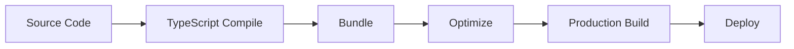

### Build Steps

**Backend:**
```bash
cd backend
npm run build  # TypeScript compilation
# Output: dist/
```

**Frontend:**
```bash
cd frontend
npm run build  # Vite build
# Output: dist/
```

---

## Deployment Pipeline

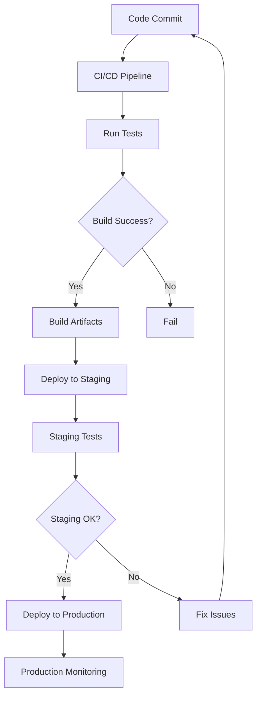

### CI/CD Steps

1. **Code Commit:** Push to repository
2. **Automated Tests:** Run test suite
3. **Build:** Compile TypeScript, bundle frontend
4. **Staging Deployment:** Deploy to staging environment
5. **Staging Tests:** Verify staging deployment
6. **Production Deployment:** Deploy to production
7. **Monitoring:** Monitor production system

---

## Production Architecture

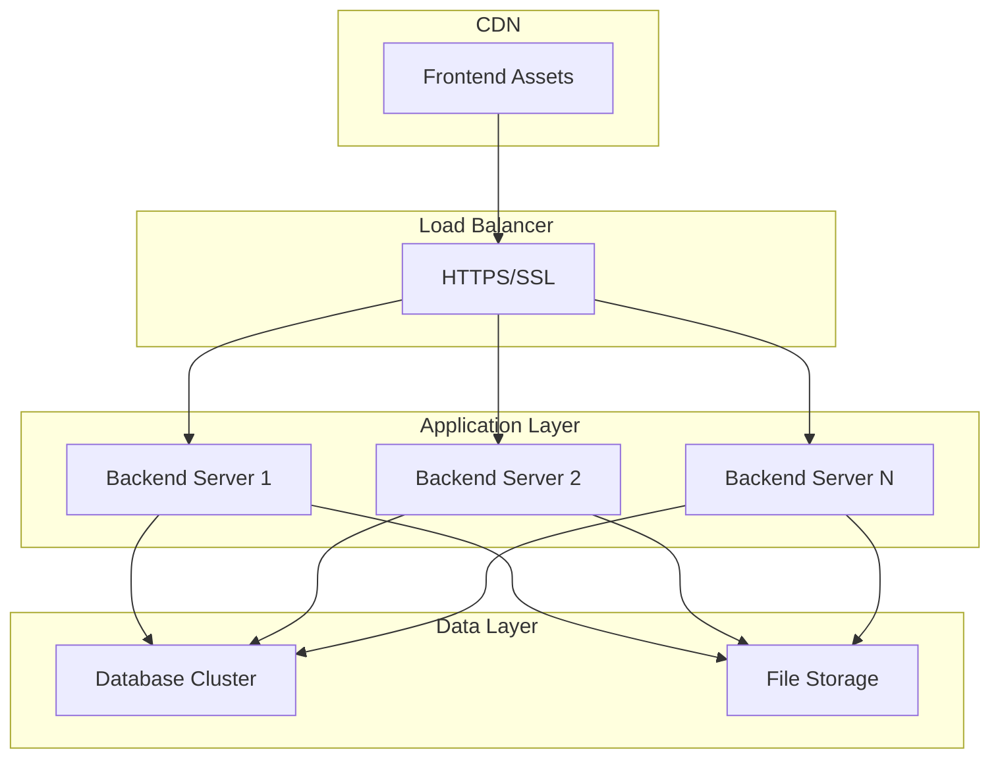

### Production Components

**Load Balancer:**
- Distributes traffic
- SSL termination
- Health checks

**Application Servers:**
- Multiple instances
- Stateless design
- Auto-scaling

**Data Layer:**
- Database for sessions
- File storage for PDFs
- Backup systems

**CDN:**
- Frontend assets
- Static files
- Global distribution

---

## Monitoring and Logging

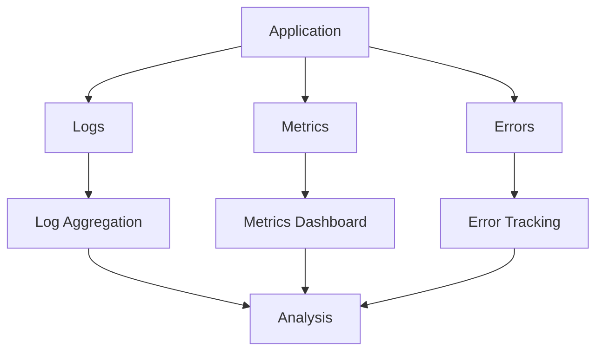

### Monitoring Setup

**Logging:**
- Application logs
- Error logs
- Access logs
- Log aggregation (ELK, CloudWatch)

**Metrics:**
- Request rate
- Response times
- Error rates
- Resource usage

**Error Tracking:**
- Exception tracking
- Error alerts
- Performance monitoring

---

## Backup and Recovery

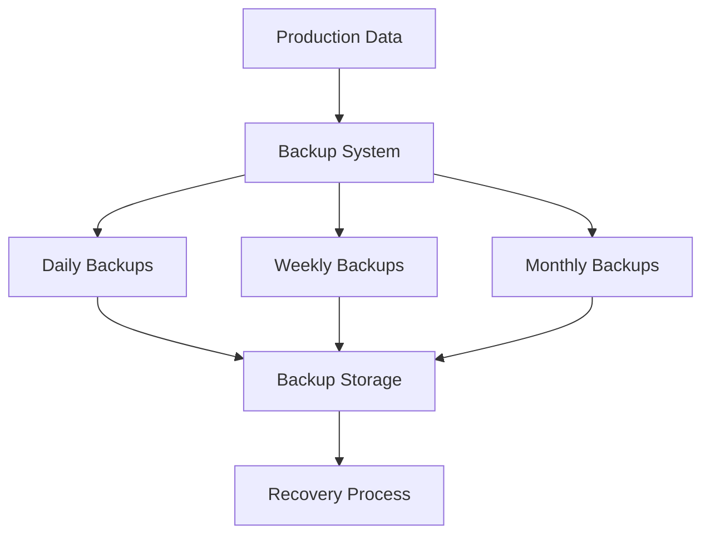

### Backup Strategy

**Data to Backup:**
- Session data (JSON or database)
- Original PDFs
- Signed PDFs
- Configuration files

**Backup Frequency:**
- Daily: Recent data
- Weekly: Full backup
- Monthly: Archive backup

**Recovery:**
- Point-in-time recovery
- File restoration
- Database restoration

---

## Security Deployment

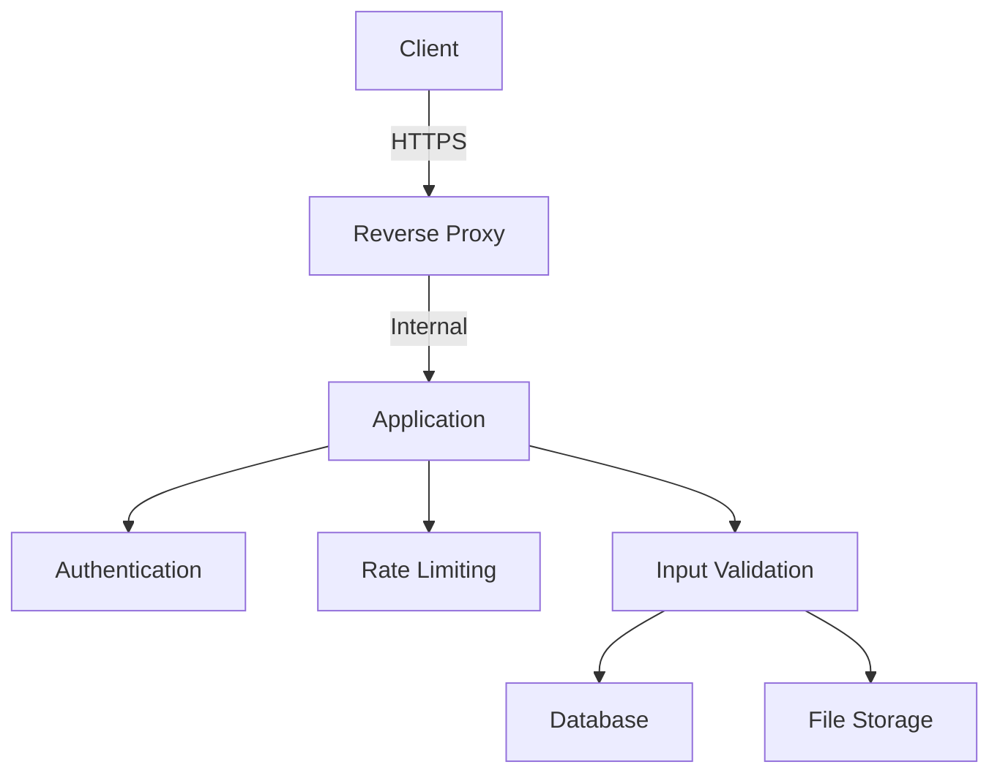

### Security Measures

**Network:**
- HTTPS/SSL encryption
- Firewall rules
- DDoS protection

**Application:**
- Authentication
- Authorization
- Rate limiting
- Input validation
- Output sanitization

**Data:**
- Encrypted storage
- Secure backups
- Access controls

---

## Scaling Architecture

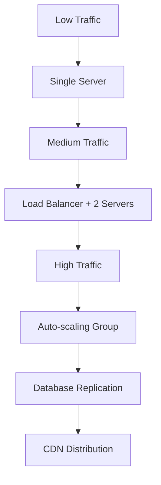

### Scaling Strategy

**Vertical Scaling:**
- Increase server resources
- Upgrade hardware
- Optimize code

**Horizontal Scaling:**
- Add more servers
- Load balancing
- Auto-scaling

**Database Scaling:**
- Read replicas
- Sharding
- Caching

---

## Deployment Checklist

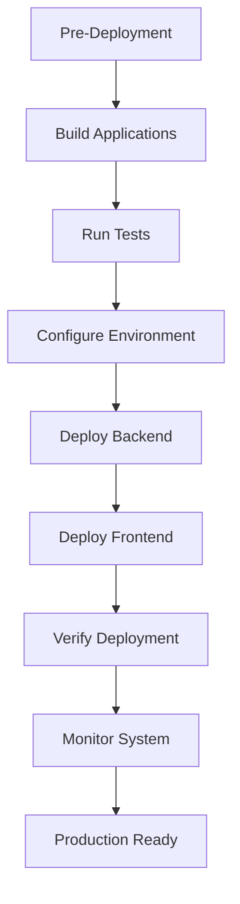

### Deployment Checklist

**Pre-Deployment:**
- [ ] Code reviewed
- [ ] Tests passing
- [ ] Environment variables set
- [ ] Database migrated (if applicable)
- [ ] Backup current system

**Deployment:**
- [ ] Build backend
- [ ] Build frontend
- [ ] Deploy backend
- [ ] Deploy frontend
- [ ] Verify API connectivity
- [ ] Test critical flows

**Post-Deployment:**
- [ ] Monitor logs
- [ ] Check error rates
- [ ] Verify functionality
- [ ] Update documentation
- [ ] Notify users (if needed)

---

## Rollback Procedure

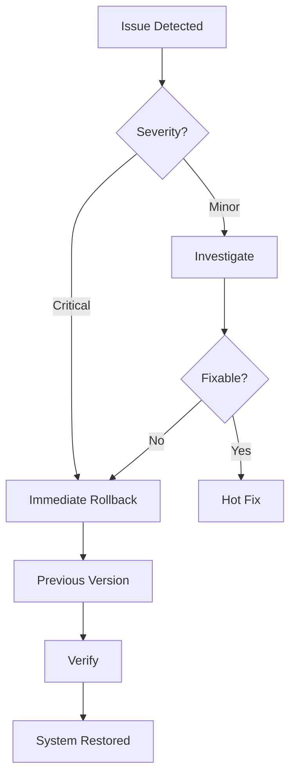

### Rollback Steps

1. **Detect Issue:** Monitor alerts, user reports
2. **Assess Severity:** Critical vs. minor
3. **Rollback Decision:** Immediate or investigate
4. **Execute Rollback:** Deploy previous version
5. **Verify:** Test critical functionality
6. **Investigate:** Root cause analysis
7. **Fix:** Develop and test fix
8. **Redeploy:** Deploy fixed version

---

## Notes for Developers

### Deployment Best Practices

1. **Version Control:** Always use version control
2. **Environment Parity:** Keep dev/staging/prod similar
3. **Configuration Management:** Use environment variables
4. **Database Migrations:** Version and test migrations
5. **Rollback Plan:** Always have rollback procedure
6. **Monitoring:** Set up monitoring before deployment
7. **Documentation:** Update deployment docs

### Deployment Tools

**Recommended:**
- **CI/CD:** GitHub Actions, GitLab CI, Jenkins
- **Containers:** Docker, Kubernetes
- **Hosting:** Vercel, Netlify, Heroku, Railway
- **Monitoring:** Sentry, DataDog, New Relic
- **Logging:** CloudWatch, ELK Stack

---

## Notes for AI Regeneration

### Deployment Requirements

1. **Build Process:** Must compile TypeScript
2. **Environment Config:** Must use environment variables
3. **Static Serving:** Must serve frontend build
4. **API Routing:** Must handle API and SPA routes
5. **File Storage:** Must handle file operations
6. **Database:** Must migrate from JSON to database (production)

### Critical Deployment Rules

1. **Never commit:** Secrets, API keys, passwords
2. **Always use:** Environment variables for config
3. **Always test:** Staging before production
4. **Always backup:** Before major deployments
5. **Always monitor:** After deployment

---

## Conclusion

This deployment documentation provides complete information about:
- **Deployment architectures:** Multiple deployment options
- **Build processes:** How to build for production
- **Configuration:** Environment setup
- **Scaling:** How to scale the system
- **Monitoring:** Production monitoring
- **Security:** Security measures
- **Backup:** Backup and recovery

Use this documentation to deploy the system to production successfully.


