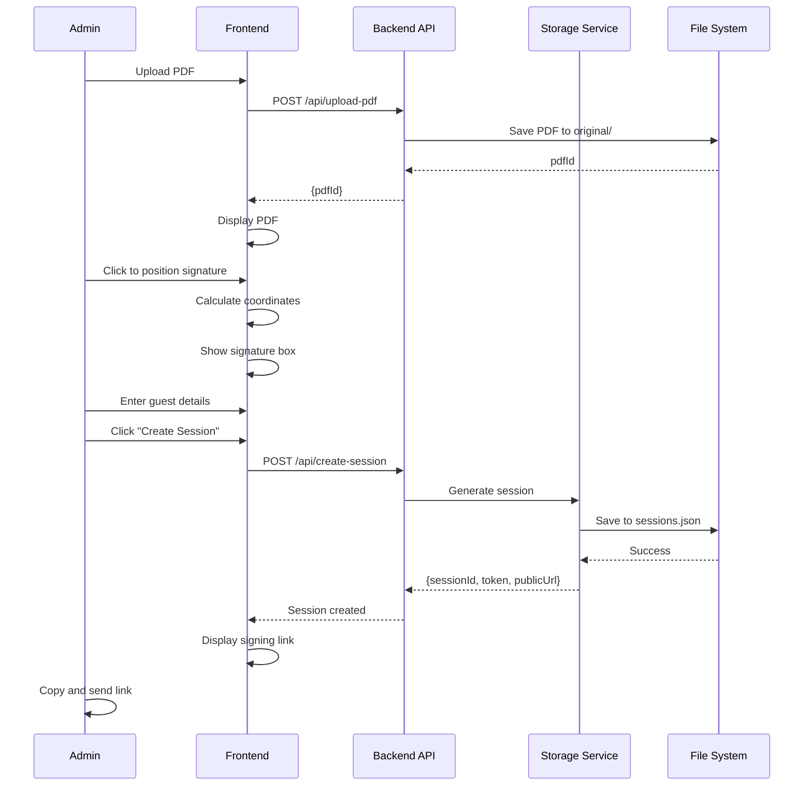
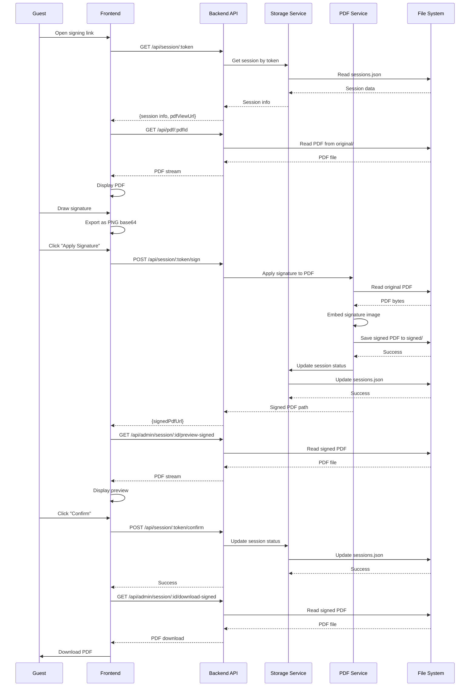
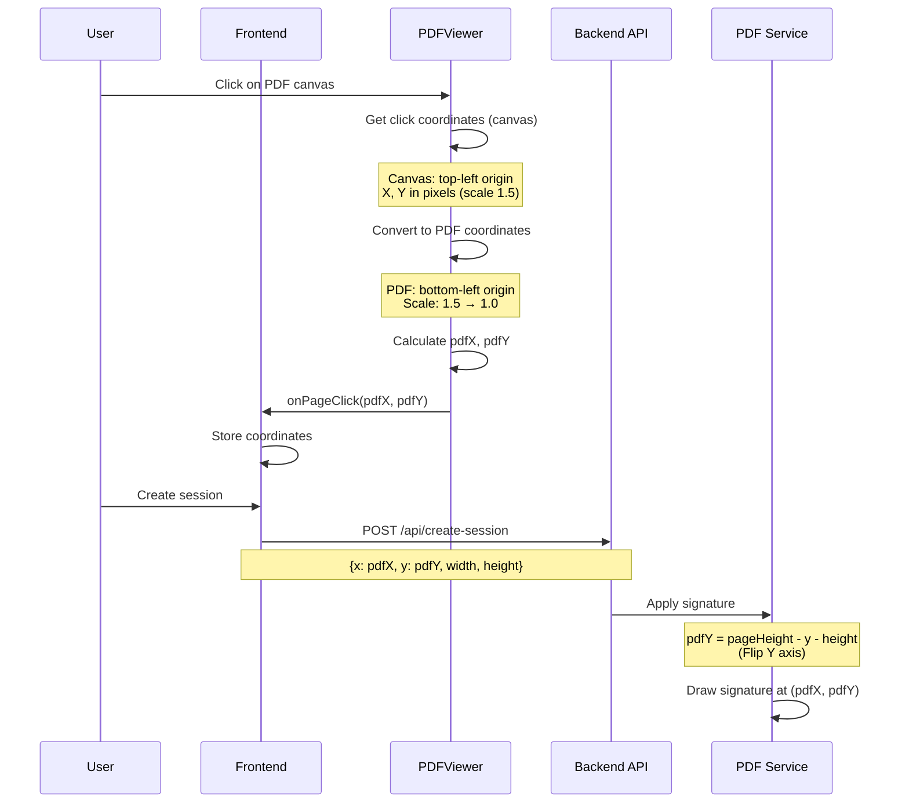
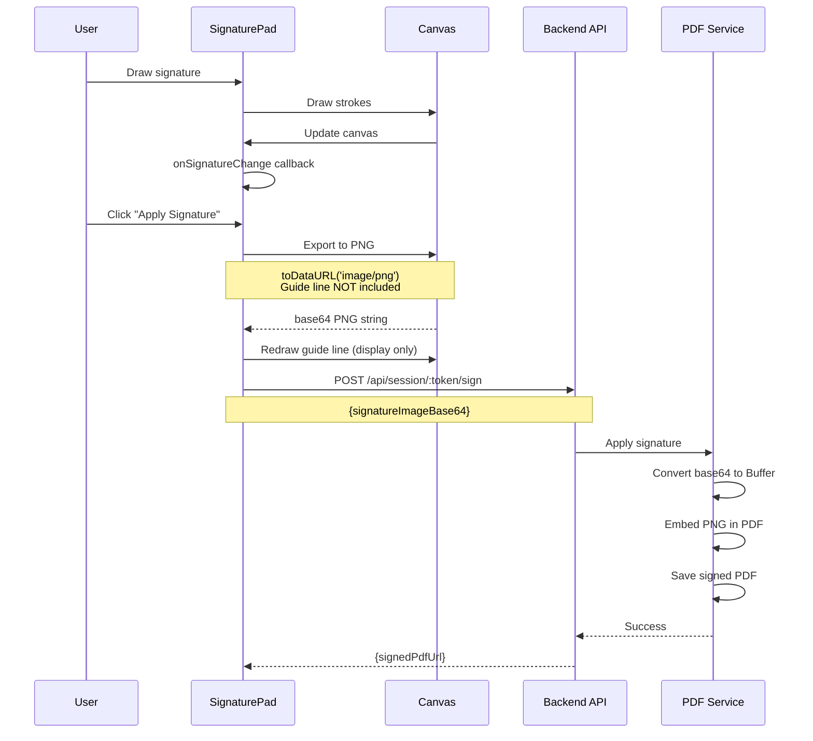
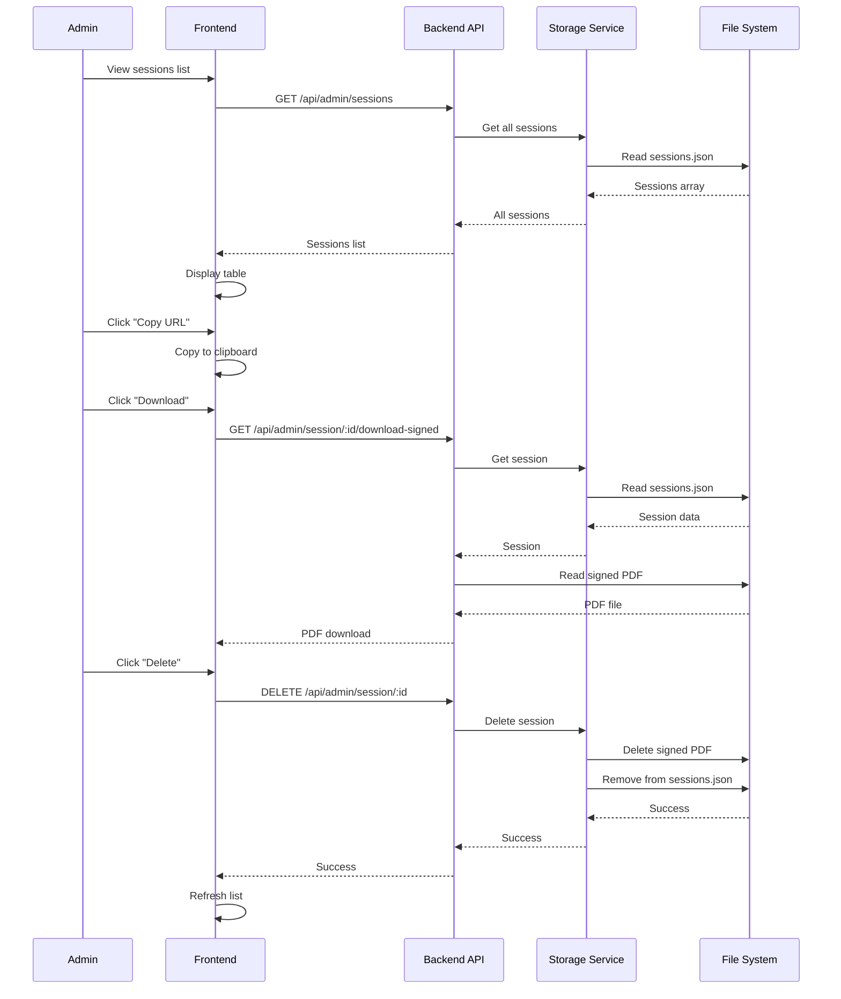
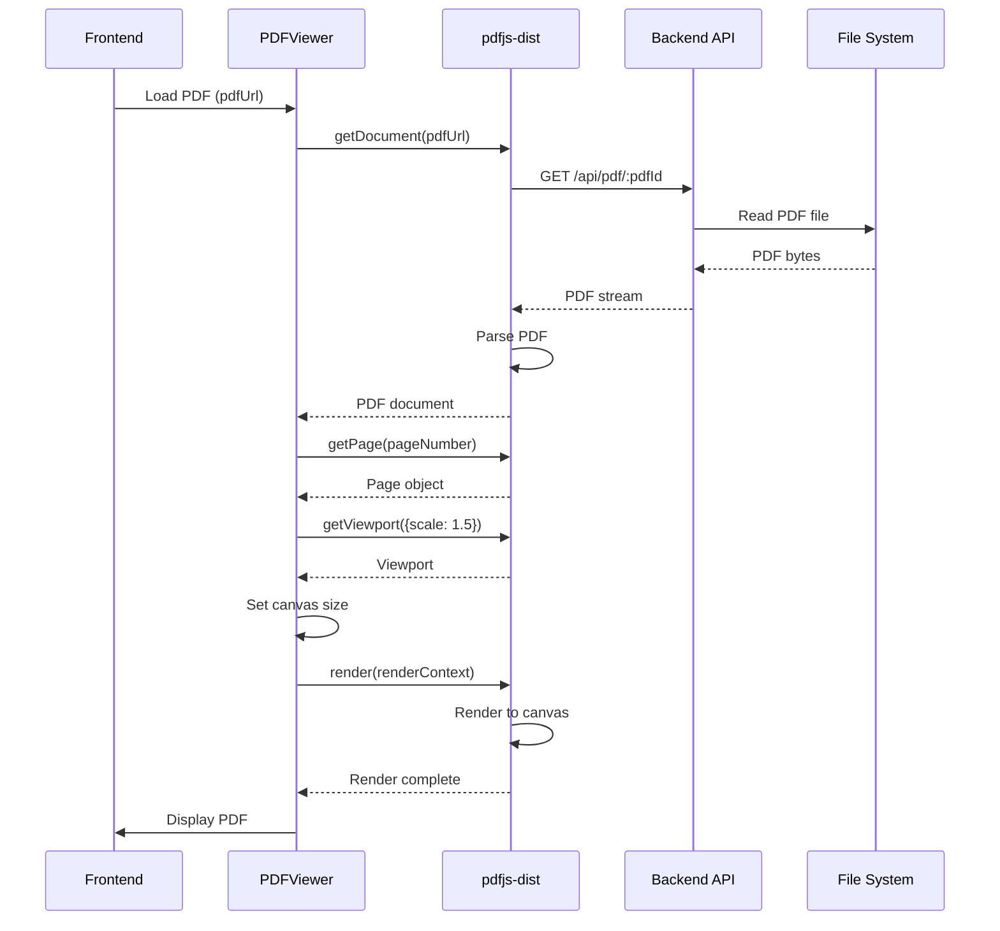
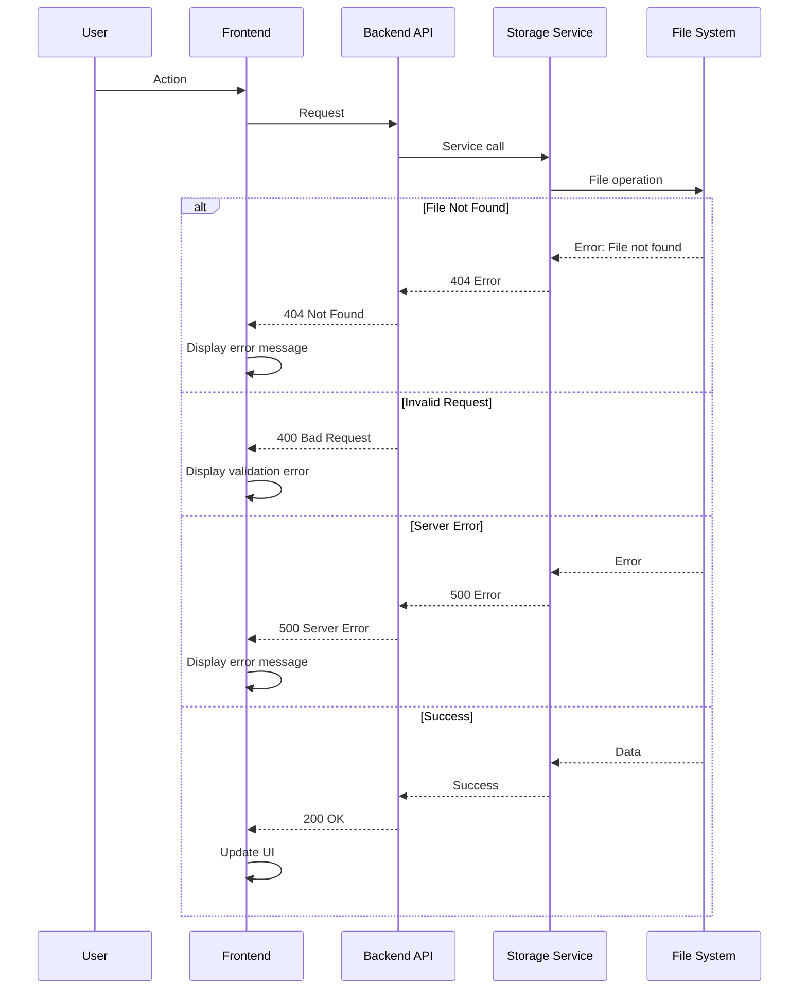
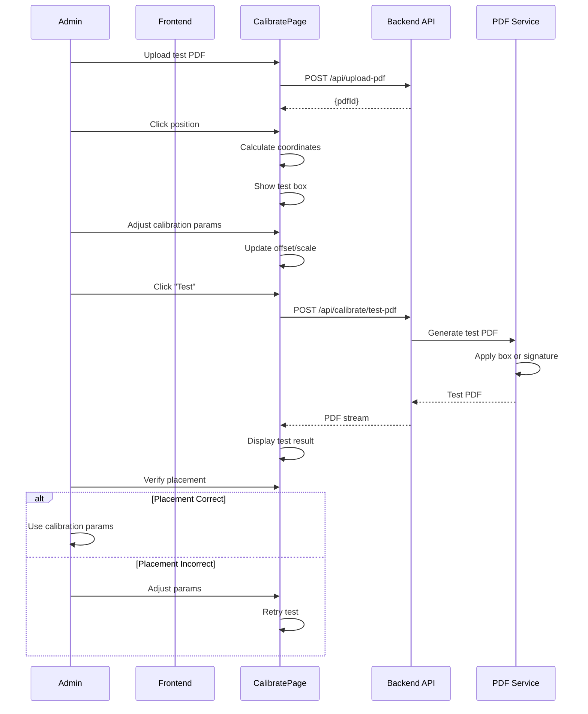
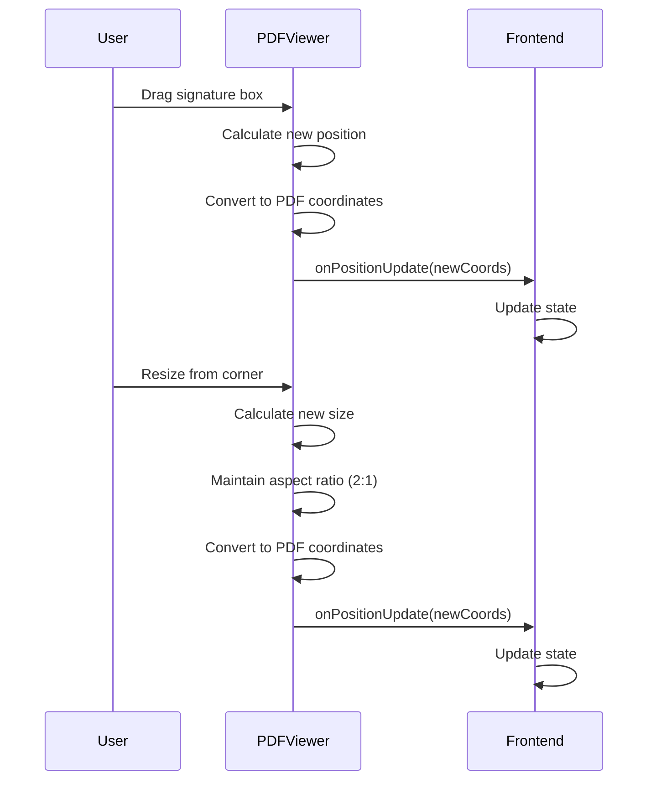
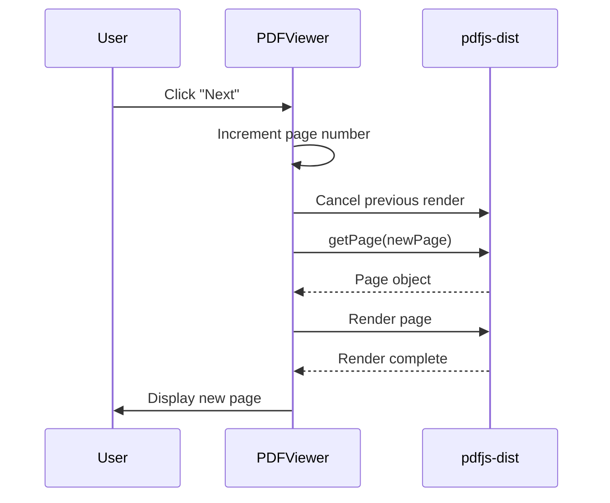

# Sequence Diagrams

## Overview

This document contains sequence diagrams for all major flows in ThaiHeavensSignApp.

## Admin Flow: Create Signing Session



### Flow Explanation

1. Admin uploads PDF file
2. Backend stores PDF and returns ID
3. Admin positions signature box on PDF
4. Admin enters guest information
5. Backend creates session and generates token
6. Frontend displays signing link

---

## Guest Flow: Sign Contract



### Flow Explanation

1. Guest opens signing link
2. Frontend fetches session information
3. Frontend loads and displays PDF
4. Guest draws signature on canvas
5. Frontend exports signature as base64 PNG
6. Backend applies signature to PDF
7. Backend saves signed PDF
8. Frontend shows preview
9. Guest confirms signature
10. Backend marks session as completed
11. Frontend downloads signed PDF

---

## PDF Coordinate Conversion Flow



### Coordinate Conversion Details

**Frontend (Canvas):**
- Origin: top-left (0,0)
- Y increases downward
- Scale: 1.5x for display
- Coordinates: pixels

**Backend (PDF):**
- Origin: bottom-left (0,0)
- Y increases upward
- Scale: 1.0x (actual PDF size)
- Coordinates: PDF points

**Conversion Formula:**
```
pdfX = canvasX / 1.5
pdfY = canvasY / 1.5
pdfY_final = pageHeight - pdfY - height
```

---

## Signature Drawing and Export Flow



### Signature Export Process

1. User draws on canvas
2. SignaturePad tracks strokes
3. On export, canvas converts to PNG base64
4. Guide line is NOT included in export
5. Guide line is redrawn after export (visual only)
6. Base64 string sent to backend
7. Backend converts to Buffer
8. Backend embeds in PDF

---

## Session Management Flow



### Session Operations

- **List:** Read all sessions from JSON file
- **Copy URL:** Frontend copies link to clipboard
- **Download:** Stream signed PDF file
- **Delete:** Remove session and associated files

---

## PDF Rendering Flow



### PDF Rendering Process

1. Frontend requests PDF from backend
2. Backend streams PDF file
3. pdfjs-dist parses PDF document
4. Frontend gets specific page
5. Frontend creates viewport at 1.5x scale
6. pdfjs-dist renders page to canvas
7. Canvas displays PDF page

---

## Error Handling Flow



### Error Handling Strategy

- **400 Bad Request:** Invalid input data
- **404 Not Found:** Resource doesn't exist
- **500 Server Error:** Internal server error
- **Success:** 200 OK with data

---

## Calibration Flow



### Calibration Process

1. Upload test PDF
2. Click to position signature box
3. Adjust calibration parameters (offset, scale)
4. Generate test PDF with box/signature
5. Verify placement
6. Adjust if needed
7. Use calibrated parameters

---

## Notes for Developers

### Sequence Diagram Conventions

- **Solid arrows:** Synchronous operations
- **Dashed arrows:** Asynchronous operations
- **Notes:** Important implementation details
- **Alt blocks:** Conditional flows

### Key Timing Considerations

- **PDF Rendering:** Can be slow for large files
- **Signature Application:** Requires PDF processing time
- **File Operations:** I/O bound operations
- **API Calls:** Network latency

### Error Scenarios

- Network failures
- File system errors
- Invalid PDF files
- Missing sessions
- Coordinate conversion errors

---

## Notes for AI Regeneration

### Required Sequence Patterns

1. **Upload Flow:** File → Storage → Response
2. **Session Creation:** Data → Validation → Storage → Token
3. **Signing Flow:** Signature → PDF Processing → Storage → Preview
4. **Coordinate Conversion:** Canvas → PDF coordinates → Backend

### Critical Timing

- Always handle async operations with await
- Cancel previous PDF render tasks
- Clear canvas before rendering
- Handle errors at each step

### State Management

- Frontend: React state for UI
- Backend: File system for persistence
- Sessions: JSON file for metadata
- PDFs: File system for documents

---

## Additional Flows

### Drag and Resize Signature Box



### Page Navigation



---

## Conclusion

These sequence diagrams document all major flows in the application. They show:
- **Data flow:** How data moves through the system
- **Component interaction:** How components communicate
- **Error handling:** How errors are managed
- **Timing:** When operations occur

Use these diagrams to understand the system behavior and to guide implementation.


