# User Flow Documentation

## Overview

This document describes user journeys and flows for both administrators and guests using Mermaid diagrams.

## Admin User Journey

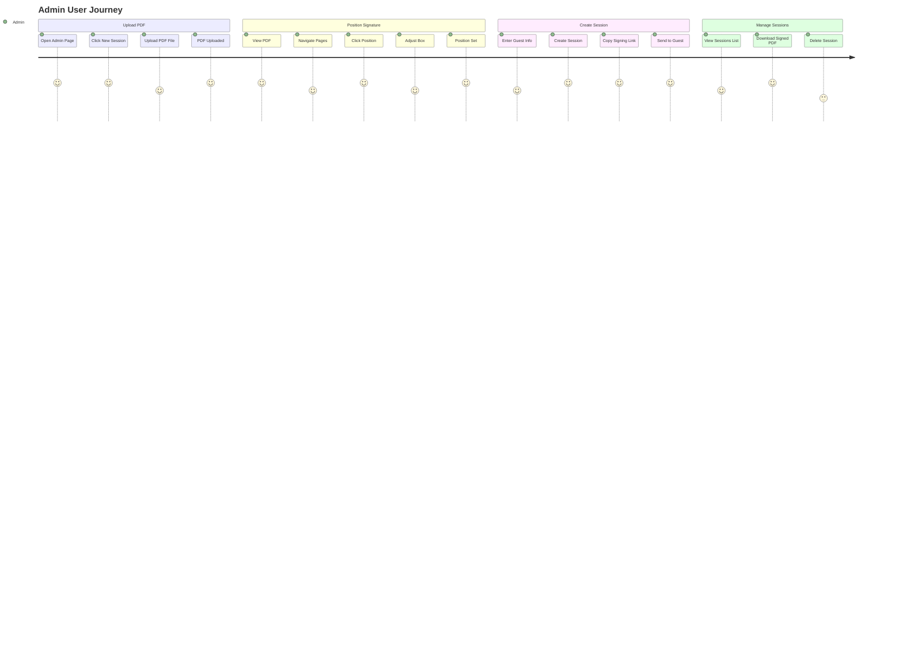

### Admin Flow Steps

1. **Upload PDF**
   - Navigate to admin page
   - Click "New Session"
   - Upload PDF (drag & drop or file picker)
   - Wait for upload confirmation

2. **Position Signature**
   - PDF displays automatically
   - Navigate to target page
   - Click where signature should appear
   - Drag/resize signature box if needed
   - Click "Continue"

3. **Create Session**
   - Enter guest name (optional)
   - Enter guest email (optional)
   - Click "Create Signing Link"
   - Copy generated link
   - Send link to guest

4. **Manage Sessions**
   - View all sessions in table
   - Copy URL for existing sessions
   - Download signed PDFs when ready
   - Delete sessions if needed

---

## Guest User Journey

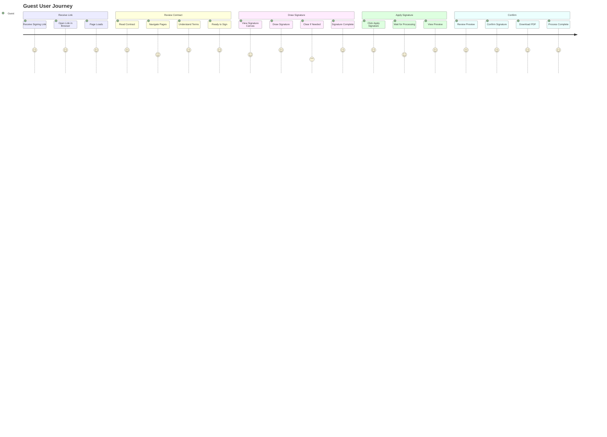

### Guest Flow Steps

1. **Receive Link**
   - Receive signing link from administrator
   - Open link in web browser (mobile or desktop)
   - Page loads with contract

2. **Review Contract**
   - Read contract carefully
   - Navigate through all pages
   - Understand terms and conditions
   - Scroll to signature section

3. **Draw Signature**
   - See signature canvas area
   - Draw signature with finger (mobile) or mouse (desktop)
   - Use guide line for alignment
   - Clear and redraw if needed

4. **Apply Signature**
   - Click "Apply Signature" button
   - Wait for signature to be applied
   - View preview of signed contract

5. **Confirm**
   - Review preview carefully
   - Click "Confirm & Download"
   - PDF downloads automatically
   - See confirmation message

---

## Complete Admin Flow Diagram

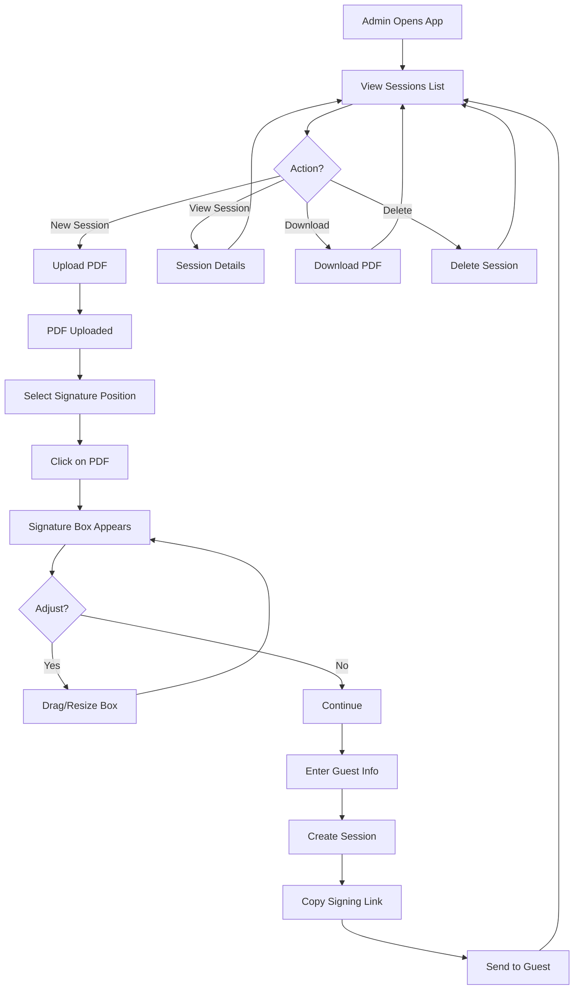

### Admin Flow Details

**Main Actions:**
- Create new signing session
- View existing sessions
- Download signed PDFs
- Delete sessions
- Copy signing links

**Signature Positioning:**
- Interactive box positioning
- Drag to move
- Resize from corners
- Real-time coordinate updates

---

## Complete Guest Flow Diagram

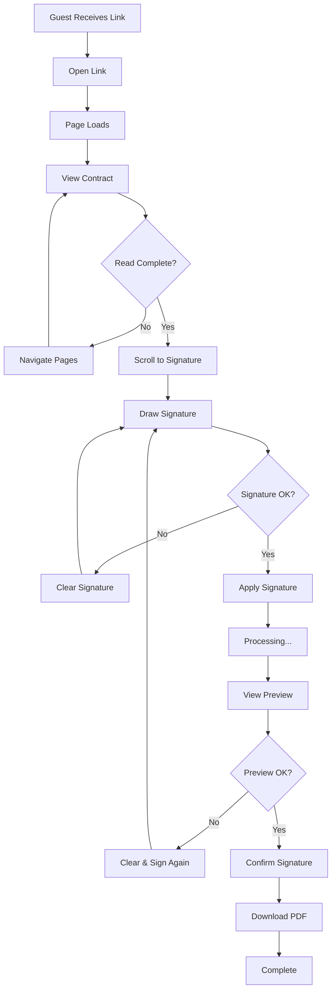

### Guest Flow Details

**Contract Review:**
- PDF viewer with page navigation
- Read-only mode
- Mobile-friendly interface

**Signature Process:**
- Touch/mouse support
- Visual guide line
- Clear functionality
- Preview before confirmation

**Confirmation:**
- Preview signed PDF
- Download option
- Final confirmation

---

## Mobile User Flow

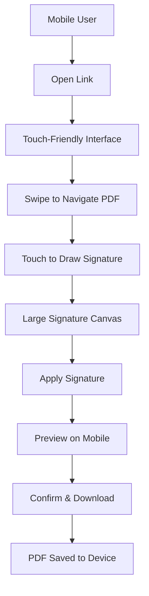

### Mobile-Specific Features

- **Touch Support:** Full touch event handling
- **Responsive Design:** Adapts to screen size
- **Large Buttons:** Easy to tap
- **Canvas Sizing:** Responsive signature area
- **Download:** Works with mobile browsers

---

## Error Flow - Invalid Link

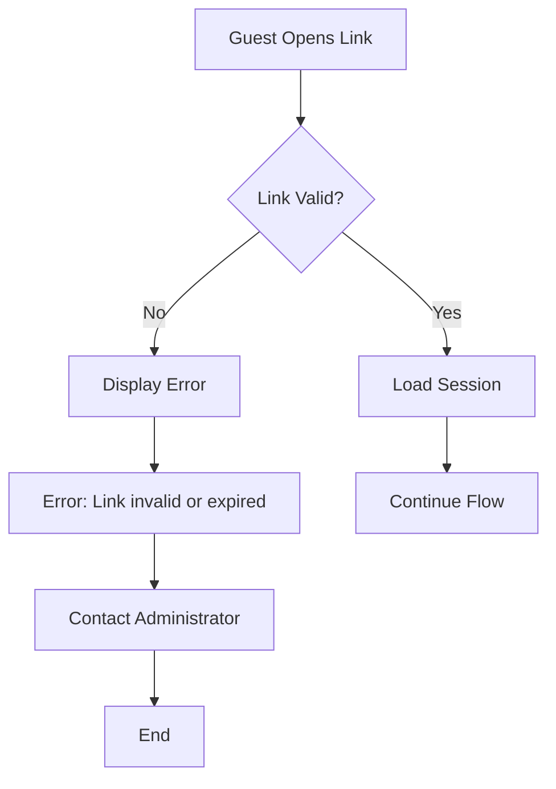

### Error Handling

**Invalid Link:**
- Clear error message
- Instructions to contact admin
- No further actions possible

**Other Errors:**
- Network errors: Retry option
- PDF loading errors: Refresh page
- Signature errors: Clear and retry

---

## Calibration Flow

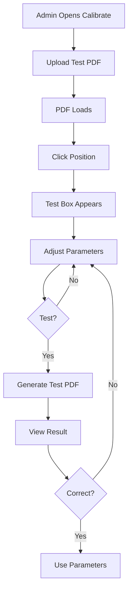

### Calibration Process

1. Upload test PDF
2. Click to position signature box
3. Adjust offset and scale parameters
4. Generate test PDF
5. Verify placement
6. Adjust if needed
7. Use calibrated parameters

---

## Session Status Flow

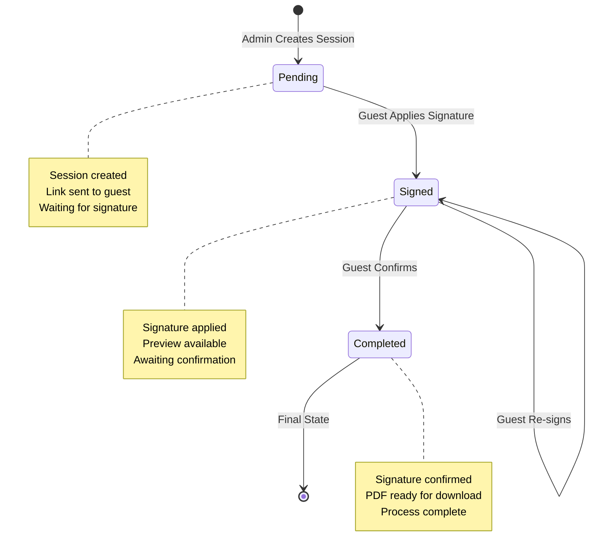

### Status Transitions

- **Pending → Signed:** Guest applies signature
- **Signed → Completed:** Guest confirms signature
- **Signed → Signed:** Guest re-signs (overwrites)

---

## User Interaction Patterns

### Admin Interactions

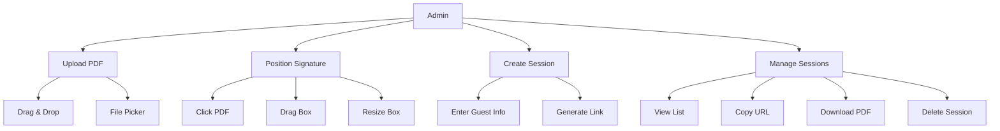

### Guest Interactions

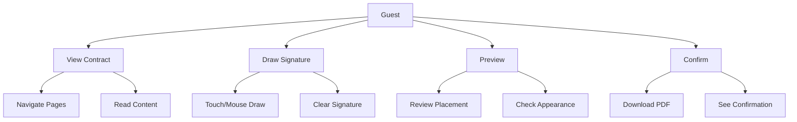

---

## User Experience Flow

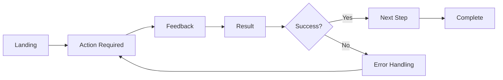

### UX Principles

1. **Clear Actions:** Large, obvious buttons
2. **Immediate Feedback:** Loading states, success messages
3. **Error Recovery:** Clear error messages, retry options
4. **Progress Indication:** Show current step
5. **Mobile First:** Touch-friendly interface

---

## Notes for Developers

### User Flow Implementation

**Key Considerations:**
- **Progressive Disclosure:** Show only what's needed
- **Error Prevention:** Validate before submission
- **Feedback:** Always provide user feedback
- **Accessibility:** Support keyboard navigation
- **Mobile:** Touch events for all interactions

### Flow States

**Admin States:**
- Sessions list
- Upload PDF
- Position signature
- Create session
- Manage sessions

**Guest States:**
- View contract
- Draw signature
- Preview signed
- Confirm and download

---

## Notes for AI Regeneration

### Required User Flows

1. **Admin Flow:**
   - Upload → Position → Create → Manage

2. **Guest Flow:**
   - Receive → Review → Sign → Preview → Confirm

3. **Error Flows:**
   - Invalid link
   - Network errors
   - Validation errors

### Flow Requirements

**Always:**
- Provide clear next steps
- Show loading states
- Handle errors gracefully
- Support mobile devices
- Give user feedback

**Never:**
- Skip validation
- Leave user without feedback
- Block on errors
- Assume desktop only

---

## User Journey Maps

### Admin Journey Map

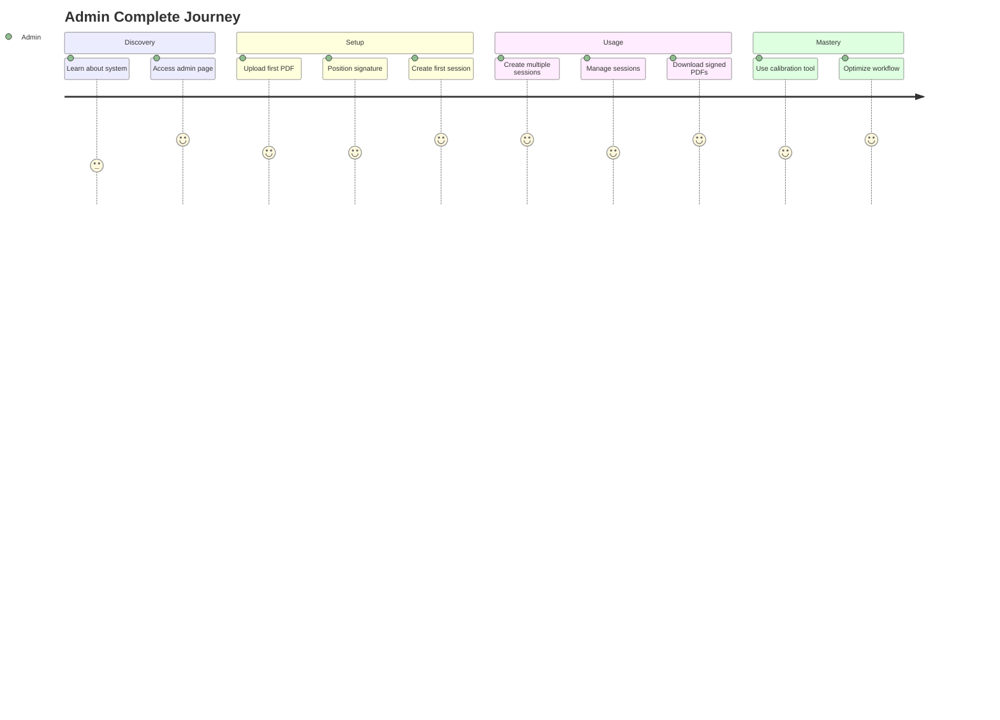

### Guest Journey Map

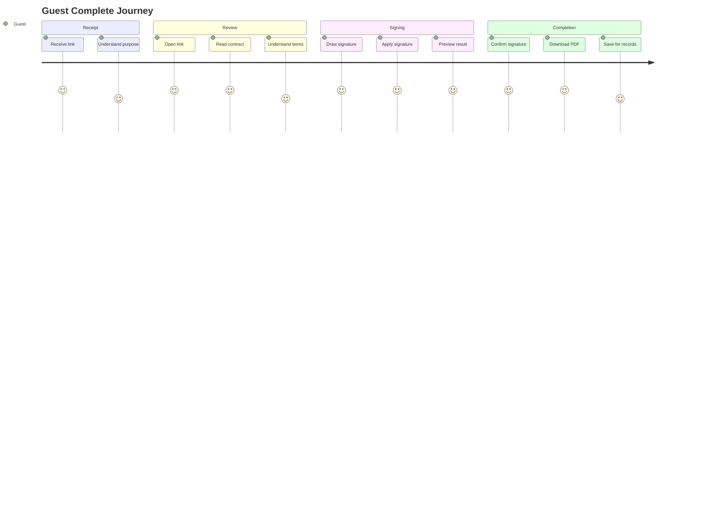

---

## Conclusion

This document provides complete user flow documentation for:
- **Admin flows:** Session creation and management
- **Guest flows:** Contract signing process
- **Error flows:** Error handling and recovery
- **Mobile flows:** Touch-optimized interactions
- **Status flows:** Session state transitions

Use these flows to understand user behavior and optimize the user experience.

